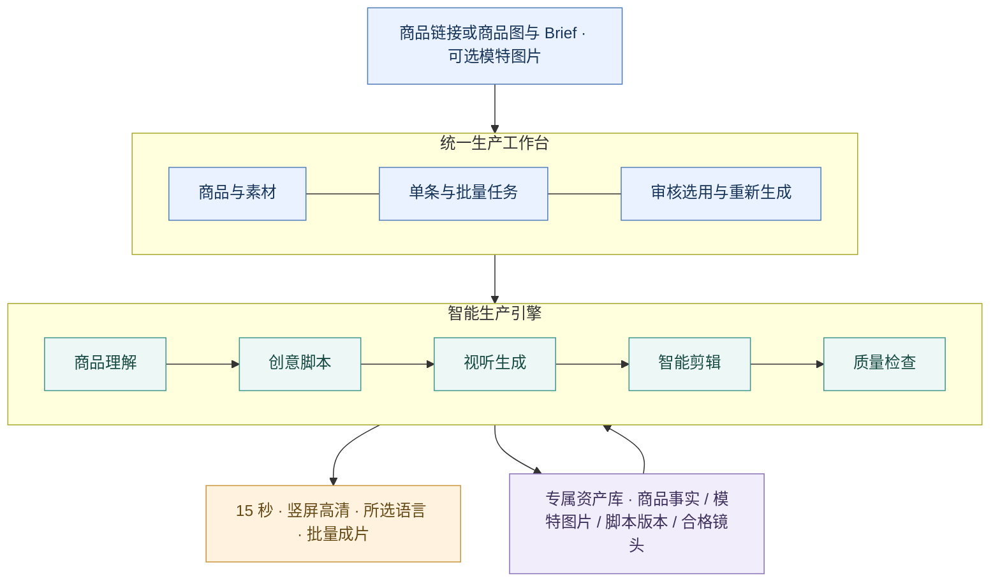
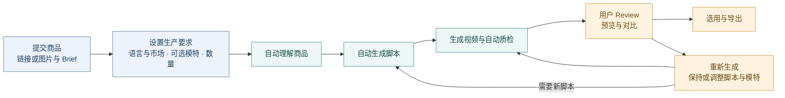
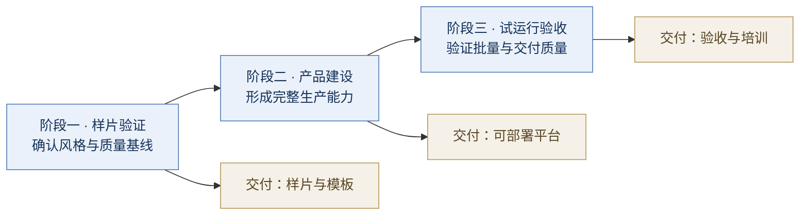

# AI UGC 视频智能生产平台建设方案

> **多语言创作 · 多市场适配 · 规模化内容供给**  
> 2026 年 9 月

## 1. 项目概述

本项目建设集**商品理解、创意策划、视频生成、智能剪辑与质量审核**于一体的 AI UGC 视频智能生产平台，为 TikTok 账号矩阵持续提供适配不同语言与市场的商品短视频，支撑账号内容发布与自然流量获取。

用户提供商品链接，或上传商品图片与创作要求（Brief），可选上传或生成模特图片。平台自动解析商品、提炼卖点、生成脚本与视频，将符合目标市场表达习惯的 15 秒 UGC 成片提交用户审核、选用或重新生成。

平台同时支持多商品批量生产，以及同一商品采用相同或不同脚本生成多条视频，帮助团队提升内容供给效率，形成统一生产标准，持续积累商品、模特与创意资产。

平台按多语言、多区域能力设计，覆盖中文、英语、日语、韩语、葡萄牙语、西班牙语等内容生产方向，适配北美、拉美、欧洲及日韩等市场的表达需求。可结合美国、墨西哥、巴西、日本等目标市场配置语言、人物风格与内容场景，用户在每次任务中选定一种输出语言，系统按所选语言与市场完成内容生产。

**项目交付是一套可部署、可操作、可持续使用的视频生产产品，覆盖从商品输入到成片交付的完整流程。**

| 业务场景 | 核心内容 | 目标市场 | 交付形态 |
|---|---|---|---|
| 账号矩阵商品内容供给 | 15 秒 UGC 风格视频 | 多语言 · 多区域适配 | 自研平台＋生产模板＋内容资产＋培训支持 |

## 2. 建设价值

账号矩阵需要持续获得适合不同受众和内容风格的商品视频，同时保持商品信息准确。随着账号、商品和创意数量增长，逐条策划、制作与修改会持续占用团队资源。本项目通过统一生产流程，将重复制作交由系统完成，让内容人员集中处理创作要求和成片选用。

| 价值方向 | 平台能力 | 对甲方的价值 |
|---|---|---|
| **生产提效** | 脚本、视听生成、字幕与剪辑协同完成 | 减少工具切换和重复制作，缩短成片交付周期 |
| **矩阵供给** | 同商品多开场、多场景、多表达角度，按内容风格分组 | 为不同账号提供差异化素材，支持持续发布与创意测试 |
| **市场拓展** | 多语言脚本、配音与区域表达适配 | 复用商品和创意资产，降低跨市场内容准备成本 |
| **质量可控** | 商品事实约束、自动检查与用户审核 | 提升商品呈现和视听质量的一致性 |
| **资产沉淀** | 商品、模特图片、脚本、声音与镜头复用 | 降低后续制作准备成本，形成团队专属内容资产 |

项目成效围绕**合格视频产出、人工处理时间、生产周期和单片成本**衡量，建立可验证的投入价值。

## 3. 总体方案

平台采用“**统一工作台、智能生产引擎、专属资产库**”的整体设计，将创意与制作能力组织为连续的生产流程。

**业务人员通过统一入口完成生产。** 底层生成、合成和检查由系统编排，模型能力通过标准接口接入，便于后续升级。平台保留素材、脚本和成片版本，支持资产复用与质量追溯。

### 与账号矩阵业务的衔接

平台负责视频生产、审核选用、素材维护与导出，运营通过既有工具完成后续发布。商品链接用于解析生成所需资料；成片以视频及其制作版本为管理对象。账号标签仅用于内容分组与导出。

| 矩阵使用要求 | 视频生产侧的对应能力 |
|---|---|
| 不同账号有不同受众与风格 | 可复用的内容配置：目标人群、模特、语气、场景；批量任务可按组应用 |
| 同一商品需要多条可发布素材 | 多脚本、多视觉方案，提供相似内容提示和人工对比选用 |
| 视频准确呈现商品 | 以输入资料约束外观、规格与卖点，检查成片表现 |
| 大量素材需要准确分发 | 按生产批次或内容标签分组导出，保留视频版本和导出记录 |

## 4. 核心能力

### 4.1 多种输入，自动理解商品

支持商品链接导入，或商品图片上传 + Brief。系统提取商品外观、规格、卖点及使用场景，结合创作要求形成内容方向，并自动进入脚本与视频生产。

Brief 可描述目标人群、重点卖点、风格、场景和禁用表达，也可附带指定脚本；未指定的创意细节由系统补充。商品链接和图片可同时提供，Brief 约束创作方向，商品事实以可靠资料为准。

### 4.2 可选模特，统一人物风格

用户可上传获授权的模特图片，也可描述形象要求，由系统生成模特图片供选择，并保存为后续可复用资产。未选择模特时，系统按 Brief 采用产品展示或适配的默认人物方案。

同一模特图片可以用于多条视频，作为人物一致性的参考；也可为不同商品或账号内容组分别指定模特，保持同组人物风格的一致性。模特图片用于视觉形象参考，声音可由系统匹配，真人声音复刻须另有授权。

### 4.3 多语言与区域化表达

每次任务选择一种输出语言及目标市场，单条和批量视频均按该语言生成。商品资料可使用原始语言输入，系统结合当地商品信息，统一生成所选语言的脚本、配音、字幕和发布配文。

| 能力层次 | 配置内容 | 应用示例 |
|---|---|---|
| **语言覆盖** | 脚本、口播、字幕和发布配文 | 中文、英语、日语、韩语、葡萄牙语、西班牙语等 |
| **区域表达** | 用词、语气、声音及生活场景 | 美国英语、墨西哥西班牙语、巴西葡萄牙语等 |
| **商品适配** | 当地商品名称、规格、计量单位和卖点 | 同一商品按目标市场资料调整表达 |
| **创意迁移** | 保留核心创意，重新组织本地脚本与镜头节奏 | 优选方案延展到不同市场的账号内容组 |

成片按所选语言完成口播调时与字幕同步，保持 15 秒成片节奏。区域化表达由对应语言样片验证，商品价格、规格和承诺以目标市场资料为准。

### 4.4 脚本与视频连续生成

系统自动完成商品理解、目标语言脚本、镜头安排、视听生成与剪辑包装。**默认直接交付成片，无需用户逐条确认商品分析、脚本或分镜。** 有明确创意要求时，用户可提供脚本，或主动开启脚本预览与编辑。

脚本围绕自然口语、生活场景及清晰商品展示展开，首期覆盖三类内容：

| 内容模板 | 表现方式 | 适用需求 |
|---|---|---|
| **人物讲解型** | 自然口播＋商品展示 | 介绍商品核心卖点 |
| **场景种草型** | 问题开场＋生活场景 | 呈现商品与使用需求的关联 |
| **使用介绍型** | 简短步骤＋商品演示 | 说明操作与使用方式 |

系统组合 AI 生成与授权实拍素材，完成配音、字幕、音乐及节奏包装，统一输出 15 秒视频。涉及实际效果或复杂操作时使用有依据的演示素材，保证商品表达真实。

### 4.5 多维批量生产

批量能力覆盖“多个商品”和“一个商品多个视频”。每批任务统一选择一种输出语言及目标市场，按商品设置脚本数量、每个脚本的视频数量及模特。共用 Brief 可批量应用，单个商品可单独调整。

| 实际场景 | 生产方式 | 使用价值 |
|---|---|---|
| **多商品快速出片** | 批量导入链接或商品资料包，为每个商品分别理解、编写脚本和生成视频 | 集中处理上新与日常素材需求 |
| **同商品、同脚本、多视频** | 保持脚本内容，生成多条表演、镜头或场景不同的成片；可固定或更换模特 | 筛选更自然、更合适的视觉表现 |
| **同商品、多脚本、多视频** | 生成不同 Hook、卖点角度或叙述结构，每个脚本再生成指定数量的视频 | 一次获得多种创意方向 |
| **矩阵分组生产** | 按商品及账号内容风格应用不同 Brief、模特、脚本和数量 | 为不同账号提供适配素材，集中组织同批次制作 |
| **优选方案继续生产** | 复用已选中的商品、脚本和模特设置，追加视频版本 | 延续满意的表达方式 |

同脚本多视频适合筛选表演与画面；用于矩阵分发时，优先从开场、叙述角度和场景形成实质差异，避免将近似版本直接批量分发。同脚本指保持既定口播与内容结构，画面可以变化；口播超出 15 秒承载范围时提示精简，不擅自改变锁定脚本。跨商品复用的是脚本结构与风格，商品事实和具体台词分别适配。

提交前展示批次总视频数与预计消耗，按明确配置执行，避免无意扩大组合。每条视频均能追溯所属商品、脚本与模特，批次内单项失败可独立处理。

### 4.6 成片评审与定向再生成

生成结果按商品、脚本和视频版本分组展示，可附账号标签。用户可预览对比、查看脚本和视频版本，标记选用、待定或不采用，并分组下载选中视频。平台提示批次内及已导出素材中的重复或高度相似内容，辅助筛选。

用户可选择“保持脚本，重新生成画面”，也可修改 Brief、替换模特、编辑或重写脚本后再生成。针对某条视频的调整仅作用于选定范围，原结果保留，便于比较。

字幕等轻量修改直接重新合成；镜头可替换时局部处理，需要整条重做时明确提示。用户主动再生成与系统失败重试分开记录，均纳入数量与预算管理。

## 5. 产品使用流程与典型场景

**用户提交资料与生产要求，系统连续完成创作，用户在成片端集中审核选用。**

### 用户只需关注三个工作区域

| 工作区域 | 用户操作 | 系统承担 |
|---|---|---|
| **创建任务** | 提供商品与 Brief，选择一种输出语言及目标市场、可选模特和生产数量 | 输入检查、配置汇总与预计消耗 |
| **生产进度** | 查看单条或批次进度，补充必要信息、取消未执行任务 | 自动解析、编写脚本、生成、质检及异常处理 |
| **成片工作台** | 预览比较、选用、分组下载或重新生成 | 相似内容提示、视频版本与导出记录 |

资料完整时直接进入自动生产；链接无法读取时提示补充图片或说明，商品资料冲突或关键信息缺失时仅暂停相关商品。用户无需为其他正常任务重复操作。

### 批量生产示例

- **新品集中制作**：导入 20 个商品链接，每个商品生成 1 个脚本、1 条视频，共 20 条。
- **单品创意探索**：1 个商品生成 3 个脚本，每个脚本生成 2 条视频，共 6 条，按脚本分组比较。
- **稳定文案多版本**：1 个商品使用同一脚本，为 2 位模特各生成 3 条视频，共 6 条，文案保持一致。
- **矩阵素材准备**：1 个商品面向 3 种账号内容风格，每组生成 2 个脚本、每脚本 1 条视频，共 6 条，按组审核导出。
- **评审后追加**：从候选中选用满意版本，保持脚本追加画面，或调整开场和场景继续生产。

批量商品可通过链接列表或表格导入，图片与 Brief 按商品分别关联；支持共用设置与逐项覆盖。生成数量按商品逐项汇总，不将每个模特、脚本和场景自动全排列。

### 15 秒内容结构与交付标准

| 0—3 秒 | 3—7 秒 | 7—12 秒 | 12—15 秒 |
|---|---|---|---|
| **吸引注意** | **呈现商品** | **演示价值** | **行动引导** |
| 问题或场景切入 | 清晰展示核心卖点 | 讲解或有依据的演示 | 简洁、完整地收尾 |

该结构作为创作参考，节奏可随脚本调整。系统控制口播长度、字幕同步与总时长，避免生硬加速或截断对白。以开场吸引停留，以清晰展示建立商品认知，结尾引导查看站内商品；字幕和重点信息避开平台界面的遮挡区域。

| 维度 | 交付要求 |
|---|---|
| 视频 | 15 秒、9:16 竖屏、1080×1920 导出 |
| 语言 | 按所选语言和市场生成口播与字幕，表达自然 |
| 商品与人物 | 商品与资料一致，人物以所选模特图片为参考 |
| 内容 | 有明确开场、清晰展示和完整结尾，遵循所选脚本策略 |
| 配套资产 | 封面、字幕、目标语言发布配文及必要披露说明 |
| 使用方式 | 按商品或账号标签分组导出，支持选用、重新生成和版本追溯 |

## 6. 质量与内容保障

建立贯穿生产流程的三道质量关口，兼顾自动化效率与交付可靠性。

| 质量关口 | 保障重点 | 执行方式 |
|---|---|---|
| **生成前：信息可信** | 商品事实、素材许可、宣传边界 | 自动解析与脚本检查，仅对关键缺失或冲突请求补充 |
| **生成中：制作可控** | 商品呈现、口播、时长、字幕和音画质量 | 自动检查、局部修复与有限重试 |
| **选用前：内容可用** | 目标语言自然度、商品呈现、内容差异与整体观感 | 用户集中审核、比较与选用 |

上传模特图片、声音和素材按授权范围使用，生成模特采用虚构成年形象；AI 内容不虚构消费者体验或商品效果。平台提供合成内容说明及广告标识配置，支持甲方按实际内容完成必要披露。内容规则按目标市场配置；墨西哥场景参考[墨西哥 TikTok Shop 内容政策](https://seller-mx.tiktok.com/university/essay?knowledge_id=8289533054535425&lang=en)、[AIGC 指引](https://seller-mx.tiktok.com/university/essay?knowledge_id=2888663881271057&lang=en)及[PROFECO 广告指引](https://www.gob.mx/profeco/prensa/profeco-emite-guia-de-publicidad-para-influencers?idiom=es-MX)。

矩阵内容以实质创意差异为目标，避免仅换字幕、音乐或模特重复分发。相似内容提示用于辅助创作与选用，不代表平台原创性认定或推荐结果。平台同时记录素材权限、导出批次与资源消耗，保障交付可追踪。

## 7. 实施路径与交付成果

采用**样片验证—产品建设—试运行验收**的推进方式，以真实商品验证关键能力，以阶段成果确认建设进度。

| 阶段 | 建设重点 | 阶段成果 |
|---|---|---|
| 样片验证 | 验证链接/图片输入、上传/生成模特、约定语种与 15 秒成片 | 样片集、首批模板、质量与成本基线 |
| 产品建设 | 完成自动生产、多种批量模式、成片评审与重新生成 | 可部署平台、生产流程、资产与版本管理 |
| 试运行验收 | 验证语言选择、多商品、同/异脚本、分组导出及视频版本管理，开展培训 | 验收报告、操作文档、培训与交接 |

**建议整体周期为 6—8 周**，以需求范围确认、商品素材、目标语言审核人员和生成服务准备齐备为启动条件；首批交付语种、区域配置、声音资源及具体计划在项目启动时双方确认，按各语种样片分别验收。

### 项目交付清单

| 交付项 | 内容 |
|---|---|
| **生产平台** | 可部署的 Web 产品，支持链接/图片与 Brief 输入、自动生产、Review 选用及重新生成 |
| **内容生产能力** | 商品解析、多语言脚本与配音、模特图片生成与复用、视频生成、自动剪辑和质检 |
| **批量生产能力** | 所选语言下的多商品、同/异脚本、多模特、内容分组及选择性追加 |
| **矩阵素材交付** | 相似内容提示、分组导出、视频版本、目标语言配文与导出记录 |
| **模板与资产配置** | 三类首期模板、人物/声音配置、试点商品及合格素材 |
| **验证成果** | 代表商品样片、批量试运行记录、质量与成本评估 |
| **上线与交接** | 约定环境部署、操作文档、使用培训及验收支持 |

## 8. 验收与项目投入

### 验收原则

以“**功能完整、成片合格、批量可用、效率可衡量**”为验收主线，使用双方确认的代表商品和质量标准进行验证。

| 验收维度 | 评价重点 |
|---|---|
| 功能完整 | 两种商品输入和可选模特流程可用，默认连续生成脚本与视频，支持成片选用及再生成 |
| 成片质量 | 15 秒规格、商品准确性、目标语言表达及音画完整性达到约定要求 |
| 批量能力 | 多商品、同/异脚本产出数量与配置一致，素材不串商品，失败任务可独立重试 |
| 评审与复用 | 分组对比与相似提示可用，保留原版本，支持选择性重新生成 |
| 语言适配 | 可选择约定语种，每次任务的口播、字幕及配文均使用所选语言，表达自然、时长合格 |
| 素材交付 | 按批次或内容标签准确导出所选视频及配套素材，视频版本与导出记录可追溯 |
| 生产效率 | 对比现有制作方式，评估人工处理时间与成片周期 |
| 成本可控 | 按合格片统计实际生成、重试和处理成本 |

业务目标是通过持续内容供给扩大曝光与商品访问机会；平台验收聚焦生产和交付能力。播放量与成交表现由内容、账号、商品及实际分发共同影响，在运营使用中观察评估。