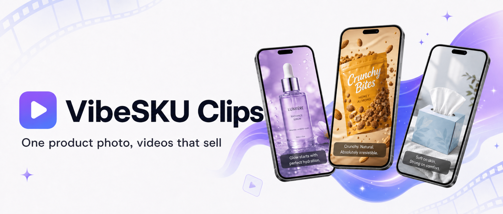
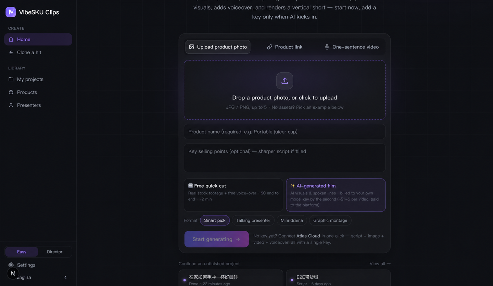
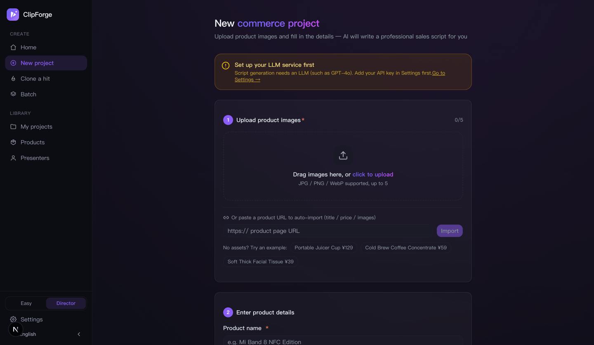
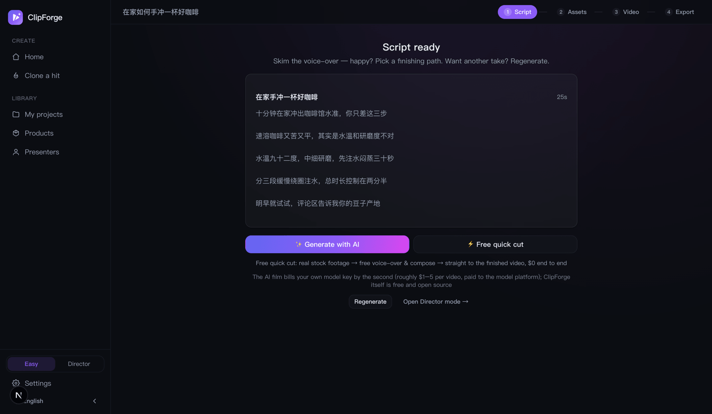
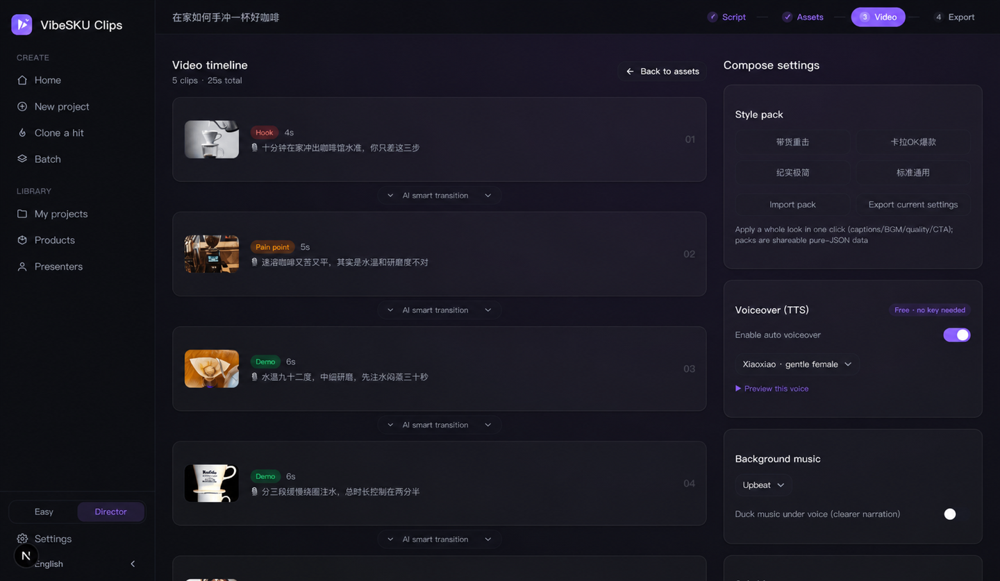
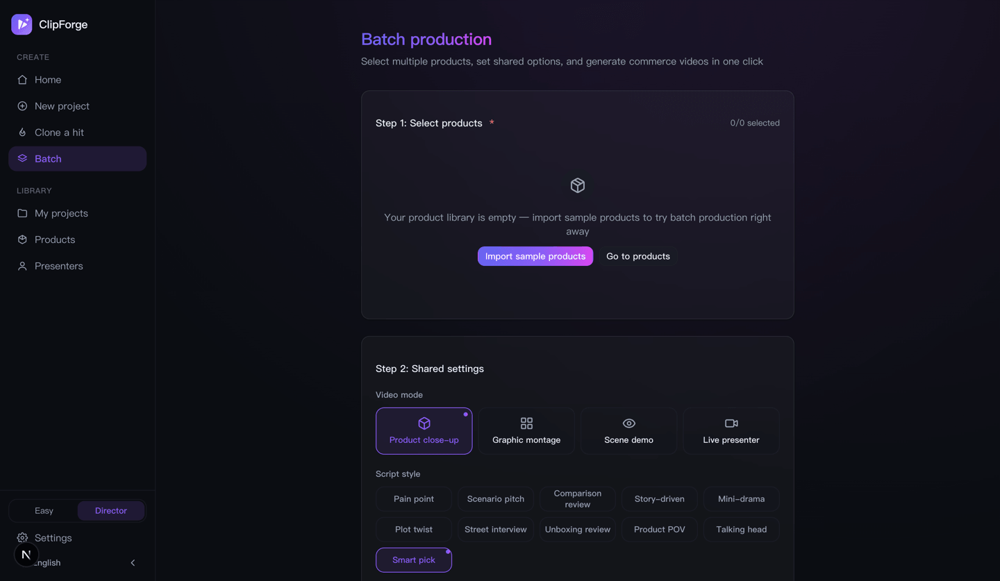
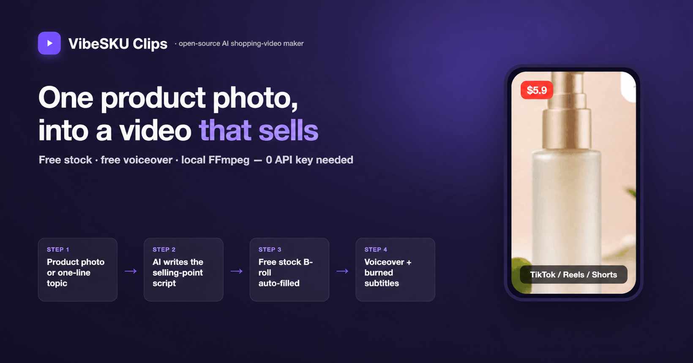

<p align="center"></p>

# ClipForge — Open-source AI shopping-video maker ｜ One product photo, an auto-generated video that sells

> **Turn one product photo into a short video that actually converts.** Upload a product image → AI extracts selling points · writes the script · **locks your product so it never gets distorted** · adds voiceover + subtitles + BGM → in tens of seconds you get a video ready to post to **TikTok Shop / Reels / Shorts / Douyin / Kuaishou / Xiaohongshu**. **One person, dozens of videos a day · 0-cost batch production · open-source, no watermark.**
>
> <sub>📌 Formerly『**带货剪手** / daihuo-jianshou』— repo · stars · history all carried over; also does "one-sentence topic → video" for any non-commerce subject.</sub>

<p align="center"><strong>🌐 Website: <a href="https://xixihhhh.github.io/clipforge/en.html">xixihhhh.github.io/clipforge</a></strong> — see what ClipForge can sell for you in 30 seconds</p>

<p align="right"><strong>English</strong> · <a href="README.md">中文</a></p>

<p align="center">
  
  
  
  
  
  
  
  
  <a href="https://skills.sh/xixihhhh/clipforge"></a>
</p>

## ✨ Highlights — 30 seconds on why this one

| Exclusive | In one line |
|---|---|
| 🎯 **Product fidelity** | Swap the background / relight — the product itself stays pixel-identical, never "Photoshopped wrong" |
| 🎬 **Real moving shots** | Image-to-video + seamless keyframe-chained transitions + 18 named camera presets pickable per shot (with Mix two-preset overlays) + 8 one-click visual looks + per-shot redo — not a still-image slideshow |
| 🎁 **Ad templates** | 391 end-to-end commerce recipes (Turntable Hero / Factory Story / Meltdown Lit / Oyster Reveal / Egg-Drop Comfort Proof / Noon-to-Midnight Blackout / Clear Mom's Cart / Fresh-Catch Fishing Log / Ugly Ads / Perfect Loop / Sassy Granfluencer / AI UGC Actors…) spanning keyboards & earbuds, tea & coffee & low-proof drinks, home fragrance & lighting, hanfu & swimwear & sun-protective wear, books, instruments, collectibles and trading cards, through the festival marketing calendar and local-life & travel deals, browsable and searchable across six groups; product-aware recommendations from name/category/selling points, plus ✨AI-custom recipes with every enum clamped to the real preset vocabularies; one click pre-fills script style + camera plan + visual look + caption/BGM compose config, everything still editable; recipes travel: save AI-custom recipes to "My templates" for reuse, export any template as a shareable JSON and import others' recipes in one click (preset-vocabulary clamping + ad-law risk-term hints) |
| 🔁 **Viral replication** | Upload a reference video: ffmpeg detects real scene cuts into a rhythm skeleton and the generated script matches its shot count and durations; references ≤15s can also one-shot replicate via Seedance reference-to-video — keeping the reference's camera work and pacing while swapping in your product |
| 🧪 **Variant matrix** | Same assets, hook copy × caption style × BGM mood combos batch-rendered as labeled outputs for A/B (compared in the export page's history list); compose-only reruns, zero AI-generation cost |
| 🎭 **Mini-drama selling** | Ten script styles with a free voice per character; **built-in ordinary-person presenter presets + a real-face constraint** so on-camera humans never look like polished AI influencers |
| 🆓 **A full video at $0** | Free stock + free AI voiceover (EN / 中 / 日 / 韩 / ES) + local compositing — no API key needed, open-source, no watermark |
| 🚦 **Don't get throttled** | AIGC labeling + ad-law banned-term scan + publish gate — compliance on by default |
| 📦 **Batch + viral remix** | 10 products rendered in one click, re-shoot a competitor's viral with your product, A/B cuts |
| 🤖 **One sentence via agents** | MCP / CLI / Skill — tell Claude / Cursor *"make a 9:16 from this product link"* |
| 💰 **Paid calls never wasted** | Cloud tasks persisted & recoverable, never auto-retried — every cent accounted for |

Want higher quality? Add one key: a single interface aggregates **7 platforms, 30+ curated models** (GPT Image 2 / Seedance 2.0 / **MiniMax H3** / Kling O3 / Veo 3.1…), plus **200+ video models dynamically discovered** from the whole Atlas catalog — new models show up without upgrading the app. Self-hosted, open-source (AGPL-3.0) — your data never leaves your machine.

## 🚀 Run it in 30 seconds

```bash
docker run -d -p 3000:3000 -v clipforge-data:/data ghcr.io/xixihhhh/clipforge
```

Open `http://localhost:3000` — **render your first video with no key at all** (free stock + free voiceover). Local dev / desktop app / model setup: see [Quick start](#quick-start).

## UI preview

| Home · one photo / one sentence | New project · paste a URL or upload | Script · 3 variants |
|:---:|:---:|:---:|
|  |  |  |
| **Compose · voiceover/subtitles/BGM** | **Export · multi-platform** | **Batch production** |
|  |  |  |

<p align="center"></p>

---

> 📚 **Detailed docs below**: [Compliance](#-compliance-first-by-default-ship-to-china-without-getting-throttled) · [What it can do](#-two-ways-to-use-it-commerce-first-but-any-subject-works) · [Core features](#core-features) · [Quick start](#quick-start) · [FAQ](#-faq) · [Roadmap](#roadmap)

## ✅ Compliance-first by default (ship to China without getting throttled)

Chinese platforms (Douyin / Kuaishou / Xiaohongshu) **silently throttle unlabeled AI content** and **suppress ad-law banned terms**. ClipForge makes compliance **on by default, zero config** — it ships compliant, you don't patch it afterward:

- **AIGC labeling (explicit + implicit, aligned with China's GB 45438-2025)**: every render **burns a default-on "内容由 AI 生成" opening badge** (top-left, >=2s — Douyin's 2026-07 rules require it, and AI voice-over alone triggers the requirement; opt-out is flagged by the release gate) plus auto-written **implicit file metadata** (generation/synthesis tags, service provider, content ID), and the export page provides a copy-ready "AI-generated" declaration line — dodging the throttle platforms apply to unlabeled AI content.
- **Pre-publish self-check**: ad-law risk terms / opening hook / duration sweet-spot / subtitle readability / call-to-action / e-commerce 3-act structure / AIGC-label status, each flagged ✓⚠✗ with a **concrete fix** (no fake score) — spot throttling risk before you render.
- **Ad-law banned-term scan**: absolute-superlative wording (Ad Law art. 9, incl. price absolutes like "lowest price ever") / medical or false-efficacy claims / claims needing certification / **false urgency** ("last day", "price goes up tomorrow") are highlighted instantly with compliant rewrite hints — **never overstate**.
- **In-video QR off-site-diversion gate**: since 2026-07 Douyin treats any in-video QR as off-site diversion (1st offense: shop window closed 7 days; 2nd: commerce rights permanently revoked) — the scan-to-buy end-card **refuses `platform=douyin` by default** (`force` overrides, private-channel distribution only), warns on other Chinese platforms, and passes clean for TikTok / Reels / Shorts.
- **AI-commerce policy guardrail 🆕 (warn-only, nothing removed)**: the publish gate raises three Douyin-2026-07 risk warnings — ① comparison/unboxing review styles are exactly the "AI-generated review content" form Douyin forbids (styles stay fully available; prefer talking-head/drama for Douyin) ② digital-human banned categories (medical / finance / beauty-efficacy / health-efficacy / education-outcome) flagged from product text ③ AI-character "personally tested" claims edge into the fabricated-usage-results red line, with recommendation-style rewrites suggested. All warn-level for human review — no style or feature is restricted.
- **AI + real-footage mix metering 🆕**: Douyin's recommendation weighting **favors AI+real hybrid content** (≥50% real footage earns a traffic tilt) — the assets page shows a live **duration-weighted real/AI ratio bar** plus per-shot "real / AI" chips, and the publish gate reports threshold status with add-real-footage advice; product photos / uploads / free real-shot stock all count as real. Informative only — labeled pure-AI publishing is unaffected.
- **Product-fidelity**: image-to-image locks the product itself — you can swap background / lighting without altering the product, which is both the conversion linchpin and a guard against "not-as-advertised" compliance/returns risk.

> When going overseas to TikTok / Reels / Shorts, scripts also carry the platform compliance reminder to "label AI-generated content and avoid exaggerated / unproven efficacy claims."

## 🎬 Two ways to use it (commerce-first, but any subject works)

- **🛍️ Product commerce video (main use case)**: **upload a product photo, or just paste a product URL** (it auto-extracts title/price/images) → AI extracts selling points and writes several sales scripts → your original product appears with fidelity + free stock B-roll → free voiceover + subtitles + BGM → one-click export in TikTok Shop / Reels / Shorts / Douyin / Kuaishou / Xiaohongshu specs.
- **🗣️ One-sentence topic video**: works even when you're not selling — type a one-line topic, AI writes the narration → free stock auto-fills the visuals (incl. key-free real footage) → free voiceover → renders a vertical short.
- **✅ Compliance + conversion switches**: AIGC metadata labeling + pre-publish self-check + ad-law banned-term scan, all on by default (see [Compliance-first by default](#-compliance-first-by-default-ship-to-china-without-getting-throttled) above), plus an end-card "tap the cart below" CTA — so you ship without violations and viewers buy on finish.
- **🛒 Product-card overlay (cart feel)**: optionally overlay a product card in the lower-left — thumbnail + name + a yellow "tap below to buy →" prompt, shown for the first few seconds to reinforce conversion.
- **📋 Copy-and-post pack**: the export page generates catchy titles + #hashtags + caption copy in one click; even without an AI key, a **key-free template version** outputs per category/platform — just copy and post.

<p align="center"></p>

## 💡 In practice: one product photo → a video in 30 seconds

Using the sample "Soft Thick Facial Tissue":

1. **Upload & name** — upload the product photo, fill in the name, pick platforms (TikTok / Reels / Shorts / Douyin).
2. **AI writes the script (~30s)** — outputs 3 sales scripts (pain-point / scenario / comparison) with golden-3-seconds hooks, hashtags, cover copy, and engagement prompts.
3. **Fill the visuals** — your product appears **with fidelity** + the free stock library auto-fills lifestyle B-roll (no AI key burned).
4. **Auto-render** — auto voiceover + burned subtitles + price tag + background music, composited for real by FFmpeg.
5. **One-click export** — toggle 9:16 / 3:4, post to your shop, and start selling.

> The whole thing is **fully automated, watermark-free**; before a big sale you can pick 10 products to **batch-render**, apply viral templates, and A/B multiple cuts.

**Keywords**: AI shopping video · short-video ad maker · e-commerce short video · product-to-video · faceless UGC ads · TikTok Shop / Reels / Shorts / Douyin / Kuaishou / Xiaohongshu · AI selling-point extraction · batch rendering · viral remix · product video generator · AI voiceover · open-source self-hosted · MCP · GPT Image 2 / Seedance 2.0

---

## 🆚 Making a shopping video: traditional outsourcing vs ClipForge

| Pain point | Traditional way | ClipForge |
|------|---------|---------|
| **Scriptwriting** | Director writes for 1–2 hours | AI generates 3 scripts in 30s |
| **Asset creation** | Shoot + retouch, 1–3 days | AI image/video, render in minutes |
| **Video editing** | Editor, 2–4 hours | Auto compositing + transitions + subtitles + voiceover |
| **Multi-platform** | Manually adjust ratio/subtitles | One-click export TikTok / Reels / Shorts / Douyin |
| **Batch output** | 3–5 videos a day at most | Pick 10 products, batch in one click |
| **Cost** | Director + shoot + edit, thousands per video | API cost, cents to a few dollars per video |

> 💡 The free path (free stock + free voiceover + local compositing) **costs $0**; you're only billed (a few dollars per video) when you opt into paid AI image/video models.

### And against similar tools?

| What you care about | **ClipForge** | Open-source peers (MoneyPrinterTurbo etc.) | Commercial AI video SaaS (Creatify / Topview etc.) | CapCut-style editors |
|---|:---:|:---:|:---:|:---:|
| **Product fidelity** (your real product, undistorted) | ✅ image-to-image lock | ❌ keyword-matched stock, product never appears | ⚠️ partial, model-dependent | ➖ paste it manually |
| **Moving-shot quality** | ✅ i2v + seamless chained transitions + adjustable/redo-able camera | ❌ stills / stock clips stitched | ✅ mostly i2v | ➖ depends on your footage |
| **Mini-drama + multi-voice cast** | ✅ ten styles, a free voice per character | ❌ single narrator | ⚠️ mostly avatar talking-heads | ❌ all manual |
| **China-platform compliance** (AIGC label / ad-law scan / publish gate) | ✅ on by default | ❌ | ❌ (mostly overseas-focused) | ⚠️ partial labeling |
| **Full video at $0** | ✅ key-free stock + voiceover | ✅ free paths exist | ❌ per-video / subscription | ⚠️ free base, paid pro |
| **No watermark + data stays local** | ✅ open-source, self-hosted | ✅ | ❌ cloud upload, watermarked free tier | ❌ cloud processing |
| **Agents / automation** (MCP · CLI · batch) | ✅ MCP + CLI + Skill + batch | ⚠️ some have APIs | ⚠️ some have APIs | ❌ |

> Based on public materials as of 2026-07; features evolve with each product's releases. ClipForge is unaffiliated with all of the above — comparison for evaluation only.

---

## ❓ FAQ

**What is ClipForge?**
ClipForge (formerly 带货剪手 / daihuo-jianshou) is an **open-source, free AI shopping-video tool**: upload one product photo and AI extracts selling points, writes a sales script, **keeps your product undistorted**, fills visuals + voiceover + subtitles, and outputs a TikTok Shop / Reels / Shorts / Douyin / Kuaishou / Xiaohongshu video in one click; it also does "one-sentence topic → video" for any non-commerce subject.

**Is it really free? Do I need an API key?**
The free path is **0-key**: assets from free commercial-use CC libraries (Openverse images + Wikimedia real footage), voiceover from free Microsoft Edge TTS, compositing from local FFmpeg. You only need a key for the platform you choose when you want paid AI image/video models.

**Can it make commerce / e-commerce shorts?**
Yes. Upload a product photo and AI analyzes selling points, writes multiple sales scripts, **keeps the product undistorted**, and exports TikTok Shop / Reels / Shorts / Douyin / Kuaishou / Xiaohongshu specs in one click.

**Is there a watermark? Can I use it commercially?**
No watermark. Self-hosted + open-source (AGPL-3.0); output is clean and commercially usable (third-party assets follow their own licenses; exports can include attribution credits).

**How is it different from CapCut / commercial AI video SaaS?**
ClipForge is **open-source, runs locally, no watermark, zero-cost on the free path, and your data never leaves your machine**; commercial SaaS usually charges per video, watermarks output, and requires uploading assets to the cloud.

**Can I use it if I can't write scripts or edit?**
Yes. The whole flow is automatic — AI writes the script, fills visuals, adds voiceover, burns subtitles, adds transitions. **No on-camera presence, no shooting, no editing.**

**Which platforms and languages are supported?**
One-click fit for TikTok / Reels / Shorts (9:16) / Douyin / Kuaishou / Xiaohongshu (3:4); the UI and docs support **中文 / English**, auto-switching by system language.

**Can an AI assistant (Claude / Cursor) generate videos directly?**
Yes. ClipForge ships an **MCP Server** (`clipforge_product_script` turns a product link straight into a sales script — see [mcp/README.md](mcp/README.md)) plus an **agent Skill** ([skills/clipforge-video](skills/clipforge-video/SKILL.md)) that teaches an assistant the whole pipeline. Install any way you like: `npx skills add xixihhhh/clipforge`; or `/plugin marketplace add xixihhhh/clipforge` in Claude Code for skill + MCP in one; or paste the Setup prompt from [skills/README](skills/README.md) to your agent and it installs itself.

---

## Core features

### 1. AI sales-script generation

- **5 deep category templates**: beauty & skincare / food & snacks / home & daily / fashion & apparel / digital & 3C
- **10 script styles (four forms)**: drama (mini-drama / plot twist / street interview / storyline) · product (unboxing / product POV / comparison) · talking-head (persona pitch / pain-point) · scene (scenario); dialogue styles auto-cast characters with distinct free voices
- **Built-in ordinary-person presenters + real-face constraint**: six presenter presets (girl-next-door / commuter / tech bro / honest uncle…) whose looks bake in real-skin, subtly-asymmetric ordinary features; any shot with a cast character automatically appends an anti-influencer-face realism constraint to image and i2v prompts — the demo videos on the website are raw output of this mechanism
- **Golden-3-seconds library**: visual shock / suspense question / sharp contrast / benefit promise / emotional resonance
- **Platform SEO**: auto-generates hashtags, cover copy, engagement prompts tuned to TikTok / Reels / Shorts / Douyin / Kuaishou / Xiaohongshu algorithms
- **Precise targeting**: set the target audience, price range, and platforms — the script matches automatically

### 2. AI asset generation (multi-model aggregation)

> 🎬 **Image-to-video is the quality path**: with a video model configured, each generated image is **automatically turned into a real moving shot via image-to-video** (the product photo is the first frame, so it stays faithful), replacing the "still + fake pan" look. The quality machinery is built in: a **motion-prompt engine** (script camera language + per-shot-type moves + product-fidelity and stability constraints — verified in real A/B calls: the unconstrained prompt grew a hand and pushed the product out of frame, the motion prompt kept it locked); **keyframe chaining** (the Dreamina pattern — each clip's last frame is pinned to the next shot's keyframe so transitions are generated inside the clip and hard cuts become seamless, with the composer speed-fitting moderately-long clips so chained endings survive); **three camera-intensity tiers** (soft / mid / bold, one click — the same keyframe can feel restrained or punchy); **per-shot motion redo** (keep the keyframe, re-run only the motion, never throw away the batch); a **named camera-preset library** (the Higgsfield "click-to-video" pattern: 18 commerce-tuned named moves — crash push-in, slow orbit, turntable, macro glide, whip pan, dolly zoom… — pickable and editable per shot on the assets page, with per-shot-type recommendations, inline free-text editing, instant persistence into the script, and the same vocabulary injected into the script LLM so first drafts already read like camera direction; plus **Mix two-preset overlays** — compound paths like orbit + push-in in one click, with conflicting combinations auto-excluded, two moves max); a **visual-look panel** (the Higgsfield Cinema Studio structured-style pattern: 8 lighting/palette presets — clean daylight, warm lifestyle, studio product, appetizing warm… — applied globally in one click, unifying keyframe lighting and pinning it through the i2v pass so it doesn't drift); and an **i2v prompt-engineering pack** (explicit single-take declaration against mid-clip cuts, an ambience-only sound line against gibberish speech, and a lint for self-contradictory camera directions). Toggle it off anytime; it falls back to the still on failure, and to the 0-cost keyless stitching path with no video model at all.
>
> 💰 **Paid-task safety**: every cloud video task is **persisted with its provider task ID the moment it is accepted** — a poll timeout, network drop, or restart can no longer lose a task you already paid for (the assets page offers "resume query", preventing duplicate billing); task-creating requests are **never auto-retried**; image-to-video requests are **validated and mapped to a true i2v model**, so "add motion" can never be billed as text-to-video; image sizes are **auto-adapted to each model's protocol** (exact aspect ratios), eliminating "invalid size but already billed" failures.

One interface aggregates 7 image/video platforms + OpenRouter LLMs and 30+ curated models, plus **200+ dynamically discovered video models** on Atlas (the live model catalog is fetched at runtime and request params are derived from each model's published schema — every new model the platform ships appears in the picker without an app upgrade):

| Platform | Image models | Video models | Highlights |
|------|---------|---------|------|
| **Atlas Cloud** ⭐ recommended | **GPT Image 2**, Seedream 5.0, Nano Banana 2 | **Seedance 2.0** (native audio), **MiniMax H3** (Hailuo 3.0 · 2K · native stereo), Kling O3, Veo 3.1, Wan 2.7, Hailuo 2.3, Vidu Q3 + 200+ discovered live | One key for LLM + image + video; widest models, best price |
| **fal.ai** | **GPT Image 2** (+edit), FLUX.1/2 Pro, Recraft V4, Seedream V5 Edit | Kling 3.0 Pro, Veo 3, Hailuo 2.3, Luma Ray 2, Vidu Q2 | Broad model set, incl. OpenAI image gen & product-fidelity edit |
| **Replicate** | FLUX 1.1 Pro/Kontext, Imagen 4, Seedream 4 | Kling v2.1, Seedance 1 Pro, Hailuo 02, Veo 3 Fast | Largest model library, unified predictions API |
| **Volcengine (Ark)** | Seedream 5.0/4.0 | Seedance 2.0/1.0 Pro (native audio) | ByteDance flagship models, cinematic quality, fast |
| **Alibaba Bailian** | Tongyi Wanxiang | Wanxiang 2.6/2.5/2.2/2.1 | Strong product image-to-video |
| **SiliconFlow** | Kolors, Qwen-Image | - | Cost-effective, China-made |
| **OpenAI** | **gpt-image-2** (any resolution + image edit), gpt-image-1.5 | - | 2026 flagship image model, strong text rendering, native 9:16, product-fidelity edit |

> **LLM (script generation)** uses the OpenAI-compatible protocol, with built-in presets for Atlas Cloud / **OpenRouter** (400+ models) / DeepSeek / Kimi / Zhipu / Doubao / OpenAI.

### 3. Multi-source free asset engine 🆕 (not just AI generation)

One English search term pulls video/image/music from multiple **free commercial-use** asset sites, auto-downloading, storing, and keeping compliance attribution — so you can fill every shot even without a product photo and without burning AI credits:

| Source | Key-free | Media | Notes |
|--------|:---:|------|------|
| **Openverse** | ✅ | image / music / SFX | Maintained by WordPress, CC-licensed, **zero-config** (best for beginners) |
| **Wikimedia Commons** | ✅ | image / **video** / audio | CC/public-domain, the **only key-free video source** (takes ≤720p webm, transcoded) + free BGM source, direct-downloadable |
| **Pixabay** | free key | video / image | Main real-footage B-roll supplement |
| **Pexels** | free key | video / image | High-quality, commercial-use |
| **Coverr** 🆕 | free key | video | Curated real footage with less "stocky" feel (2000 req/h); attribution flows into the credits manifest automatically |
| **Jamendo** 🆕 | free key | music BGM | Huge CC music library, **hard-filtered to pure CC-BY** (NC/ND/SA all excluded — syncing music into video is an adaptation, so this is the commerce-safe subset) |
| **Freesound** 🆕 | free key | SFX | 500k+ sound effects (unboxing rustles / clicks / ambience), hard-filtered to CC0/CC-BY, 128kbps HQ preview direct links |
| **Local pool** | ✅ | video / image | Upload your own B-roll; auto-fill prefers **your** footage first, free stock fills the gaps |

- Unified `/api/stock/search`: `source` for a single source or `all` for **aggregated search** (prefers the requested media type, key-free sources, and portrait orientation)
- **Key-free real-footage B-roll** via Wikimedia Commons — fill shots with motion video **without any key** (`footage:"auto"` does "video first, image if missing" per shot)
- **Free background music**: optionally add a CC track at compositing time (with a Jamendo key it searches a real music library by mood; key-free falls back to Wikimedia Commons audio), mixed under the narration and auto-ducked
- Stores the source page / author / license for compliance (CC sources come with ready attribution); exports can generate credits; English search terms recall better
- **Always has a fallback**: if a term returns nothing, it retries with broader fallback terms, so even niche topics never leave a shot blank
- **Per-shot auto-fill** `/api/project/[id]/stock-fill`: after each shot produces an English search term, it pulls visuals from the free libraries shot by shot. The assets page has a one-click **"Auto-fill visuals (free stock)"**: always available for topic videos; for commerce projects it also fills B-roll (hooks, social proof) when no image model is configured, and **automatically skips product-image shots** (protecting product fidelity) — so even users without an AI key can ship.
- Plus **NASA imagery / Internet Archive** — two key-free public-domain archive sources (documentary/science topics, opt-in, excluded from default aggregation)
- Great API-less free sites (Mixkit / Videezy / Mazwai etc.) work via the "manual download → local pool" route: drop files into the project pool and they join auto-fill (verify each site's license per clip)

### 3b. One-sentence topic video 🆕 (no product, zero barrier)

You don't need to be selling: type a one-line topic (e.g. "how to brew a pour-over coffee at home") on the home page and it runs end-to-end:

1. **Write the script** `/api/topic/script`: a de-commercialized narration engine, 5 styles (knowledge / emotional story / lifestyle / motivational / travel scenery), each shot producing an English search term
2. **Auto-fill visuals** `/api/project/[id]/stock-fill`: pulls visuals shot-by-shot from the free libraries (Openverse, key-free), with the "always has a fallback." The assets page offers one-click **"Auto-fill visuals (free stock)"** — **no image key needed** to give every shot real footage
3. **Composite** `/api/project/[id]/compose`: FFmpeg adds motion + burned subtitles + **free AI voiceover** (Microsoft Edge keyless TTS, no key) into a vertical short with sound

New projects are tagged `contentType=topic` and share the second half of the commerce pipeline; truly "type one sentence → get a video."

### 4. Four video modes

| Mode | Best for | Strategy | Realism |
|------|---------|------|--------|
| **Product close-up** | High-ticket items | Product image + motion FX, no AI face anywhere | Highest |
| **Image montage** | FMCG / daily goods | Fast-paced product images + text cards + transitions | High |
| **Scene demo** | Skincare / kitchen / fitness | AI-generated usage scenes (hands/back, avoiding fake faces) | Mid-high |
| **On-camera presenter** | IP accounts | Character system + user-uploaded real footage | Depends on footage |

### 5. Video compositing engine

- **Professional FFmpeg pipeline**: H.264 High Profile, faststart, 256k AAC — real output
- **Burned subtitles**: auto-detects a CJK font (a full CJK subtitle font is bundled so zh/ja/ko render consistently on every OS); two viral subtitle styles — **① rapid short-card flashes** (**cards break at punctuation into natural phrases** — never mid-word; punctuation-pause-weighted timing follows the voice; only punctuation-free lines fall back to even char/word splits); **② karaoke per-character highlight** (sentence stays on screen, each character lights up as the voiceover "sings" past it, libass-rendered, aligned to TTS timing with no ASR). CJK by character, English by word — built for "80% watch on mute" retention
- **Caption style presets**: four one-click looks — **Standard boxed** (white on a translucent box) / **Bold punch** (big type, heavy outline, no box — the high-retention creator look) / **Minimal** (small, thin stroke, clean documentary feel) / **Karaoke**; selectable everywhere (video page, CLI `--caption`, MCP `captionPreset`), guarded by a pixel-level real-render regression test
- **Style packs**: apply a whole finished-video look in one click (caption preset / BGM mood / ducking / quality / CTA / product card) — 4 built-in packs (Commerce Punch / Karaoke Viral / Clean Documentary / Standard) plus **import/export of JSON pack files** for team sharing; packs are **purely declarative data** (whitelist-validated, nothing executable) — the novice-safe way to "install an external skill"
- **Contact sheet**: the whole finished video condensed into one PNG — an evenly-sampled filmstrip plus the audio waveform — so black frames, caption collisions, audio spikes and dead-air endings show at a glance; agents can call it via MCP and *look* at the image to self-check a render before delivering (export page / CLI `clipforge sheet` / MCP `clipforge_contact_sheet`)
- **Smart transitions**: AI first/last-frame (Seedance 2.0 / Vidu) / AI reference (Kling) / crossfade / hard cut
- **Ken Burns motion**: slow push / pan / depth drift — makes a static product image feel alive without altering the product
- **Dual voiceover**: paid OpenAI-compatible TTS (more controllable), or **free Edge keyless TTS** (no key, multilingual voices with preview) as a zero-config fallback, generating per-shot narration and aligning subtitles to its timing; **narration is never cut mid-sentence** — text-based duration estimate backs up a failed probe, a natural breathing gap sits between segments, and fades only ever consume tail silence
- **Mixed-source normalization**: unifies pixel format / SAR / frame rate across sources so xfade/concat don't fail on mismatches
- **Smart audio**: audio-capable models output narrated video directly; BGM is auto-mixed and ducked
- **Optional motion elements** (opt-in): [remotion/](remotion/README.md) renders animated title cards / per-character kinetic captions — the smooth motion FFmpeg can't do; not part of the base install (`npm run render:element`)

### 6. E-commerce efficiency tools

| Feature | Notes |
|------|------|
| **Product library** | Enter product info once, generate many video styles repeatedly |
| **Batch rendering** | Before a big sale, pick multiple products and **batch-render everything in one click** — script → visuals → compositing runs fully automatically (0-key on the free path), built for 2026's "mass variants + A/B" playbook |
| **Viral templates** | Save data-proven scripts as templates, apply to new products in one click |
| **Viral remix** | Paste a competitor's viral video link, AI extracts the script logic, re-shoot with your product |
| **Brand settings** | Logo watermark / brand color / consistent end-card across all videos |
| **Character management** | Reuse on-camera characters across projects, AI keeps appearance consistent |
| **Multi-platform export** | One video auto-fits TikTok / Reels / Shorts (9:16) / Douyin / Kuaishou / Xiaohongshu (3:4) |
| **A/B variants** | The export page re-renders the same video into **different subtitle styles + BGM variants** (karaoke/short-card × upbeat/energetic) and downloads each, so you can test which converts (all key-free) |

### 7. Platform SEO

Scripts auto-adapt to platform algorithms; every video outputs a full SEO pack:

```json
{
  "title": "Video title (with core keyword)",
  "hashtags": ["#hashtag1", "#hashtag2", "#hashtag3"],
  "coverText": "Bold cover text",
  "interactionGuide": "Tell me in the comments — worth it or not?",
  "description": "Video description (with keywords)"
}
```

- **TikTok / Douyin**: strong hook in the first 3s, an info high-point every 5s, price anchor, cart prompt
- **Kuaishou**: down-to-earth scenes, value-for-money core, casual community tone
- **Xiaohongshu (RED)**: polished tutorial feel, "save first" prompt, keyword-optimized titles

---

## Quick start

### 🐳 Self-host with Docker (fastest — no Node / FFmpeg needed)

```bash
docker run -d -p 3000:3000 -v clipforge-data:/data ghcr.io/xixihhhh/clipforge
# Open http://localhost:3000 — make videos keyless (free stock + Edge TTS)
```

The image bundles ffmpeg and the CJK subtitle font; your data (projects / product images / renders) persists in the `clipforge-data` volume. To enable AI image/video or paid TTS, open **Settings** and add the relevant provider key. Image: `ghcr.io/xixihhhh/clipforge` (see the repo **Packages**), auto-built and smoke-tested on every Release.

### Local development

> This project uses **pnpm** (declared in `packageManager`). Don't use `npm install` — pnpm's symlink layout makes npm error. No pnpm? Run `corepack enable` or `npm i -g pnpm`.

```bash
# Clone
git clone https://github.com/xixihhhh/clipforge.git
cd clipforge

# Install (pnpm required)
pnpm install

# Start the dev server
pnpm dev

# Open the browser
open http://localhost:3000
```

> Every push / PR runs `lint → test → build` via **GitHub Actions** (see `.github/workflows/ci.yml`); it merges only when green.

### First-time setup

1. Click **Settings** (top-right) and configure at least one AI platform's API key (we recommend **Atlas Cloud** — one key for LLM + image + video)
2. Configure the LLM (needed for script generation; any OpenAI-compatible endpoint works)
3. In "Defaults," pick your default image / video models (e.g. GPT Image 2, Seedance 2.0)
4. (Optional) Add a character under "On-camera" and brand visuals under "Brand"
5. Back on the home page, click **New project** to start

> Compositing needs local **FFmpeg** (install it yourself: `brew install ffmpeg` / `apt install ffmpeg`).

---

## Tech architecture

```
┌─────────────────────────────────────────────────┐
│  Frontend (Next.js 16 + React 19 + Tailwind 4)  │
│  Pages: Home/Topic/Products/Batch/New/Script/Assets/Compose/Export/Settings │
└──────────────────┬──────────────────────────────┘
                   │
┌──────────────────▼──────────────────────────────┐
│  API layer (Next.js Route Handlers)             │
│  /api/llm/script  /api/ai/image  /api/ai/video  │
└──────────────────┬──────────────────────────────┘
                   │
┌──────────────────▼──────────────────────────────┐
│  Business logic                                  │
│  Script engine (prompt + templates + SEO)        │
│  AI provider abstraction (7 platforms, 30+ models)│
│  Multi-source asset engine (Openverse/Pixabay/Pexels)│
│  Video compositing (FFmpeg + transitions + motion + mix)│
└──────────────────┬──────────────────────────────┘
                   │
┌──────────────────▼──────────────────────────────┐
│  Data layer                                      │
│  SQLite + Drizzle ORM / Zustand (frontend persist)│
└─────────────────────────────────────────────────┘
```

| Layer | Tech |
|------|------|
| **Framework** | Next.js 16 + React 19 |
| **Language** | TypeScript 5 (strict mode) |
| **Styling** | Tailwind CSS 4 + shadcn/ui |
| **State** | Zustand (localStorage persist) |
| **Database** | SQLite + Drizzle ORM (auto-migrates on start, runs even with no tables) |
| **Compositing** | FFmpeg (fluent-ffmpeg) |
| **AI integration** | OpenAI SDK (LLM) + 7-platform image/video providers |
| **Asset engine** | Multi-source licensed assets (Openverse key-free / Pixabay / Pexels), registry-style aggregated search |
| **Testing** | Vitest + Playwright (E2E) |
| **CI/CD** | GitHub Actions (lint + test + build) |
| **Desktop packaging** | Electron + electron-builder (Win/Mac; packaged app verified to launch with working DB routes) |
| **Icons** | react-icons (Lucide) |

---

## Project structure

```
src/
├── app/                              # Page routes
│   ├── page.tsx                      # Home (project list + quick entries)
│   ├── products/                     # Product library
│   ├── batch/                        # Batch rendering
│   ├── settings/                     # Settings (AI platform / LLM / character / brand)
│   ├── project/
│   │   ├── new/                      # New project (form + video mode + character + template)
│   │   ├── clone/                    # Viral remix
│   │   └── [id]/
│   │       ├── script/               # Script editor (3 variants + save as template)
│   │       ├── assets/               # Asset generation (per-shot + batch)
│   │       ├── video/                # Compositing (transitions + voiceover + BGM + subtitles)
│   │       └── export/               # Export (multi-platform + A/B + download)
│   └── api/                          # API routes
│
├── lib/
│   ├── providers/                    # AI provider abstraction (7 platforms) + multi-source asset engine
│   ├── script-engine/                # Script engine (prompt + templates + SEO)
│   ├── video-composer/               # FFmpeg compositing engine
│   ├── paths.ts ffmpeg-path.ts       # Injectable paths (for Electron packaging)
│   ├── stores/                       # Zustand state
│   └── db/                           # SQLite + Drizzle (migrate on start)
│
├── electron/                         # Electron main process + packaging hooks
└── components/ui/                    # shadcn/ui component library
```

---

## Supported AI models (confirmed against official docs, 2026.08)

### Video generation

| Model | Platform | Audio | Mode | Notes |
|------|------|------|------|------|
| **Seedance 2.0** ⭐ | Atlas Cloud | Native | T2V / I2V / ref / first-last | ByteDance's latest, native audio, 4–15s, up to 1440p |
| **MiniMax H3** 🆕 | Atlas Cloud | Native stereo | T2V / I2V / ref / first-last | Hailuo 3.0 omni-modal (launched 2026-07-31), 2K, 4–15s, mixed image/video/audio references |
| **Kling O3** 🆕 | Atlas Cloud | Native | T2V / I2V / ref / first-last | Kuaishou omni-modal MVL, multi-shot narrative, 3–15s |
| **Veo 3.1** 🆕 | Atlas Cloud / fal.ai | Native | T2V / I2V / first-last | Google flagship, 4/6/8s, up to 4K |
| **Wan 2.7** 🆕 | Atlas Cloud | Native | T2V / I2V / ref / first-last | Multi-shot narrative + AV sync, voice-clone references |
| **Seedance 2.0 Mini** 🆕 | Atlas Cloud | Native | T2V / I2V / ref / first-last | Lightweight & economical for high-volume output |
| **Kling 3.0 Pro** | fal.ai / Atlas Cloud | Native | T2V / I2V | Kling, multi-shot + face binding |
| **Vidu Q3 Pro** | Atlas Cloud | - | T2V / I2V / first-last | First/last-frame transitions (transition magic) |
| **Hailuo 2.3** | Atlas Cloud / fal.ai | - | T2V / I2V | MiniMax, lifelike motion physics, 6/10s |
| **Luma Ray 2** | fal.ai | - | T2V / I2V | Realistic motion & physics |
| **Seedance 1.5 Pro** | Volcengine / Atlas Cloud | - | T2V / I2V | ByteDance, cinematic quality |
| **Wanxiang 2.6** | Alibaba Bailian | - | I2V | Strong product image-to-video |

> The table above is the built-in curated set (with capability guards). With Atlas Cloud enabled, the settings page also **dynamically discovers 200+ video models** across the catalog (Youchuan, HappyHorse, Grok Imagine, Gemini Omni Flash… with per-request pricing shown), and request bodies are built from each model's published schema at submit time — new platform models need no app upgrade.

### Image generation

| Model | Platform | Notes |
|------|------|------|
| **GPT Image 2** ⭐ | Atlas Cloud | OpenAI's latest, any resolution, great product texture, natural-language edits (background/lighting/text) |
| **Nano Banana 2** | Atlas Cloud | Google, strong-consistency image editing |
| **FLUX.2 Pro** | fal.ai | Latest-gen high-quality generation |
| **Recraft V4 Pro** | fal.ai | Strong design styling |
| **Seedream 5.0 Lite** | Volcengine / Atlas Cloud | ByteDance, CJK-optimized, edit to relight while locking the subject |
| **Wanxiang** | Alibaba Bailian | Product-scene friendly |

> T2V = text-to-video, I2V = image-to-video. Audio-capable models output narrated video directly; others output silent.
> For commerce, prefer **edit-class models** (GPT Image 2 / Seedream edit) to relight the product background while locking the subject from being altered.

---

## Development

```bash
# Run tests
pnpm test

# Lint
pnpm lint

# DB migration (after editing the schema)
pnpm drizzle-kit generate

# Production build (incl. .next/standalone, for Electron packaging)
pnpm build

# Package the desktop app (mac; first run lets pnpm fetch electron/ffmpeg binaries)
pnpm pack:dir   # unpacked .app to release/ (fast, layout check)
pnpm dist       # .dmg installer
```

---

## Use cases

- **E-commerce sellers**: Taobao / Pinduoduo / TikTok Shop / Douyin shops — quickly batch-produce product promo videos
- **Short-video operators**: MCN agencies, creator studios — boost content output efficiency
- **Brands**: fast multi-platform launch assets for new products
- **Indie developers**: build an AI video SaaS on top of this project

---

## Roadmap

> Per-version history lives in [GitHub Releases](https://github.com/xixihhhh/clipforge/releases); usage details for each capability are in [Core features](#core-features) above.

**Done**
- ✅ **Main pipeline**: AI scripts (5 categories × ten styles in four forms + golden-3s + platform SEO) → product-faithful assets (7 platforms, 30+ models) → i2v moving shots (motion-prompt engine / named camera presets per shot / visual looks / keyframe chaining / intensity tiers / per-shot redo) → FFmpeg compositing (viral captions / free multi-voice TTS / BGM / smart transitions / style recipes / quality presets) → multi-platform export (bitrate pinned under re-compression thresholds)
- ✅ **Zero-cost loop**: key-free asset engine (Openverse / Wikimedia real footage / NASA / local asset pool, semantic matching + cross-shot dedup + same-source continuity) + free Edge TTS (self-built keyless client) + local compositing — a full video with no API key at all; one-sentence topic videos / bring-your-own-script / dubbing for going global
- ✅ **Publish gatekeeping**: one-click publish gate (ad-law wordlist / video QC / asset license credits, `--strict` CI-ready) + AIGC labeling (explicit badge + implicit metadata per the Chinese national standard) + product-visible-in-3s precheck + off-site QR policy guard + anti-homogenization variant engine + native-feel post-processing + contact-sheet review image
- ✅ **Scale & growth**: batch rendering / viral templates & remix / A/B variants / data flywheel (feed real conversion numbers back into script generation) / trending topics / cover images / Xiaohongshu card decks / preview GIFs / shop-link QR with UTM tracking
- ✅ **Integrations & distribution**: MCP Server (one-sentence video for agents) / CLI / agent Skill / Docker image / Electron desktop app (mac verified; CI-built .dmg/.exe pending) / bilingual UI / CI pipeline

**Planned (real AI editing)**
- [ ] Auto subtitle ASR (whisper / transformers.js) → burned subtitles
- [ ] Import existing video to edit + silence-trim
- [ ] Cut long video into viral clips — available today via [HotClip](https://github.com/xixihhhh/hotclip) by the same author
- [ ] Digital-human lip-sync (fal.ai Lipsync) / timeline editing

---

## From the same author

✂️ **[HotClip](https://github.com/xixihhhh/hotclip)** — open-source AI long-video clipper: drop in a podcast or stream VOD, AI finds the highlights and cuts publish-ready vertical clips with word-level captions, all on your own machine. **ClipForge builds short videos from a single image; HotClip clips highlights out of long videos** — the "cut long video into viral clips" item above, available today.

---

## License

[AGPL-3.0](LICENSE) © 2026 xixihhhh

Modification / redistribution (incl. SaaS) must stay open-source and keep attribution.

---

<sub><b>Keywords</b>: AI short-video generator · AI shopping video · one-sentence to video · text to video · faceless video generator · AI short video maker · TikTok / Reels / Shorts / Douyin / Kuaishou / Xiaohongshu maker · AI UGC e-commerce ads · AI voiceover · free-stock auto editing · open-source / self-hosted video tool · AI script generation · MCP server · ClipForge (formerly 带货剪手 / daihuo-jianshou).</sub>

<sub>ClipForge is an independent open-source project, not officially affiliated with TikTok, Douyin, Kuaishou, Xiaohongshu, YouTube, Shopify, Amazon, Microsoft, OpenAI or any model provider; follow each third-party model's and asset's terms when using them.</sub>
