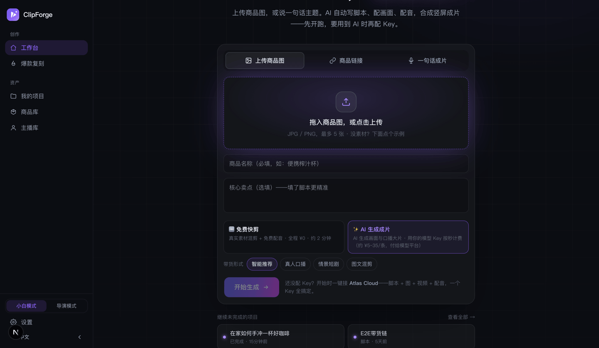
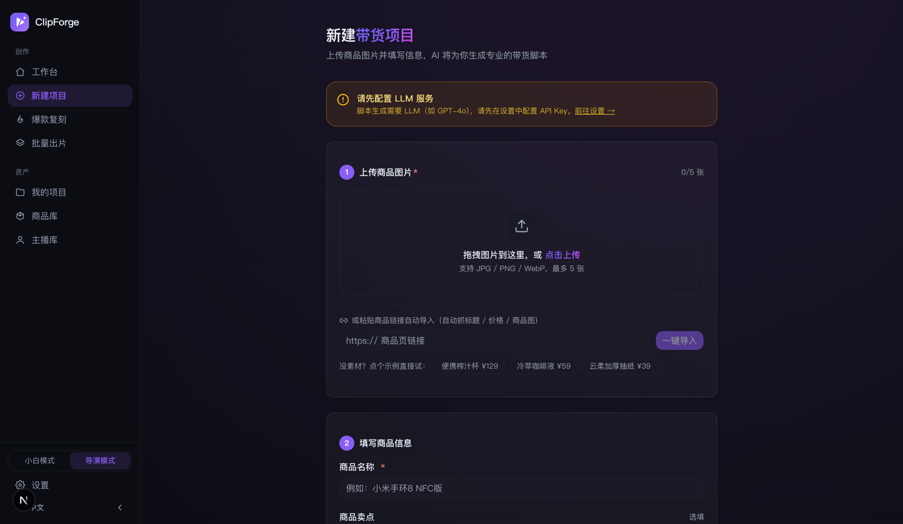
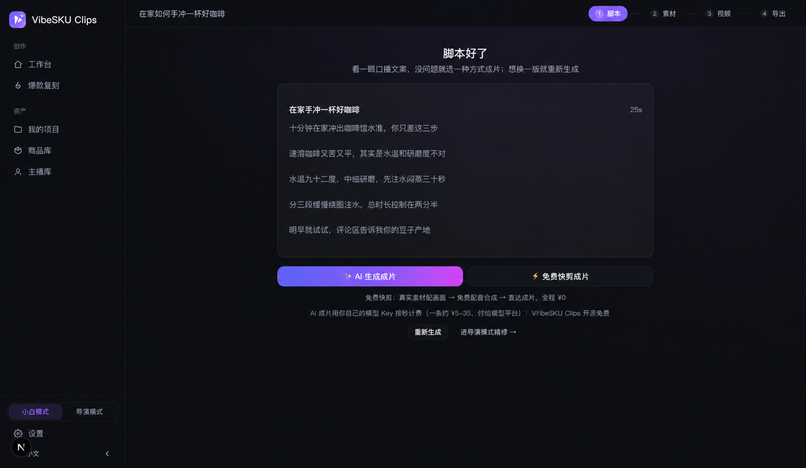
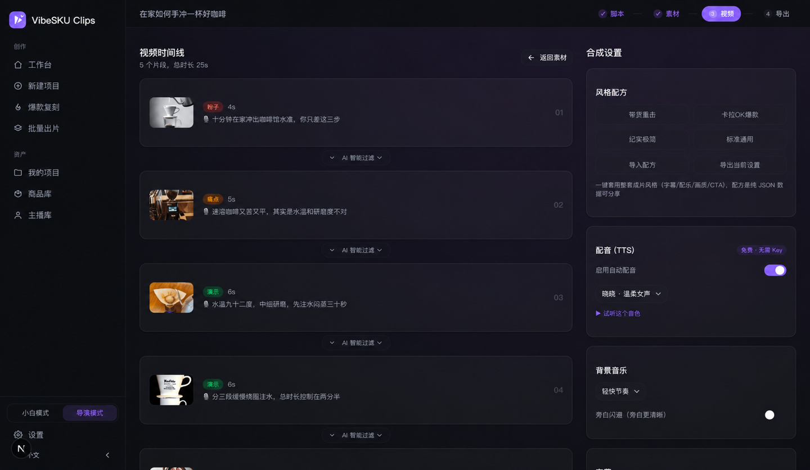
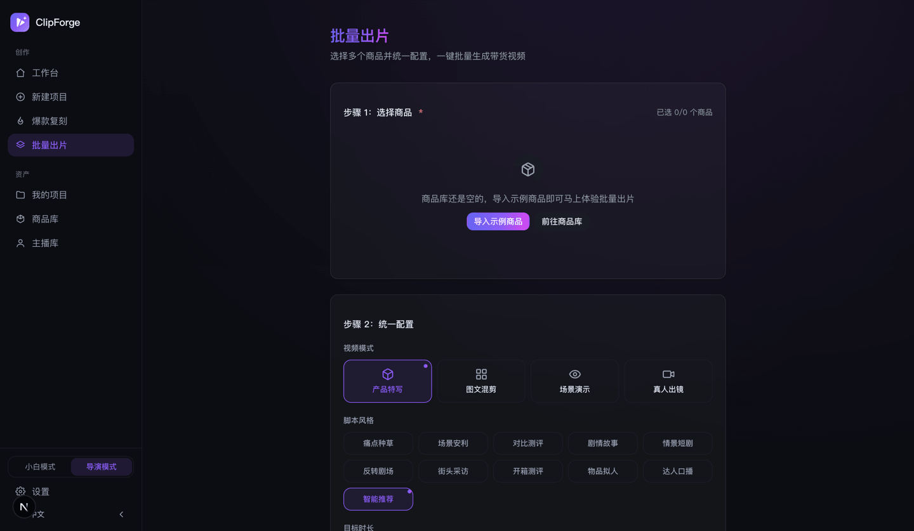

<p align="center"></p>

# ClipForge — 开源 AI 带货短视频神器 ｜ 一张商品图，自动出卖货视频

> **把一张商品图，变成会出单的卖货短视频。** 上传商品图 → AI 提炼卖点 · 写种草脚本 · **锁定商品原图不变形** · 配音 + 字幕 + BGM → 几十秒产出能直接发**抖音小店 / 快手 / 小红书 / 视频号 / TikTok Shop** 的带货视频。**一个人一天出几十条 · 0 成本批量 · 开源无水印。**
>
> <sub>📌 原『**带货剪手** / daihuo-jianshou』，仓库 · Star · 历史全部延续；也支持「一句话主题成片」做任意非带货题材。</sub>

<p align="center"><strong>🌐 官网:<a href="https://xixihhhh.github.io/clipforge/">xixihhhh.github.io/clipforge</a></strong> — 30 秒看懂 ClipForge 能帮你卖什么</p>

<p align="right"><a href="README.en.md">English</a> · <strong>中文</strong></p>

<p align="center">
  
  
  
  
  
  
  
  
  <a href="https://skills.sh/xixihhhh/clipforge"></a>
</p>

## ✨ 亮点一览：30 秒看完为什么选它

| 独家能力 | 一句话 |
|---|---|
| 🎯 **商品保真** | AI 换背景 / 打光，商品本体一个像素不改——产品绝不被 P 坏 |
| 🎬 **真·动态镜头** | 图生视频 i2v + 链式无缝转场 + 18 款命名运镜预设每镜可选（可 Mix 双预设叠加）+ 8 款画面风格一键套用、不满意单镜重跑——不是静图 PPT |
| 🎁 **成片模板** | 391 款电商成片配方（转台大片/工厂溯源/发疯文学/挑食终审官/开蚌取珠/鸡蛋不碎测/正午变午夜/清空妈妈购物车/开渔现捞记/糙手丑广告/无缝循环片/毒舌奶奶体/AI素人开麦…）覆盖 3C 键盘耳机、茶咖酒饮、香氛灯具、汉服泳装防晒、图书乐器谷子卡牌到节日大促日历与酒旅本地生活，六分组可筛可搜；按商品名/类目/卖点自动「为你推荐」，还可 ✨AI 定制专属配方（枚举全部钳制进真实预设词表）；一键套用脚本风格+运镜编排+画面 Look+字幕 BGM 全链路预填，选完仍可逐项改；模板即配方可流通：AI 定制配方可存入「我的模板」反复选用，任意模板一键导出 JSON 分享、他人配方一键导入（预设词表钳制+广告法风险词提示）；「我的模板」可整包打包导出、多款配方一次导入；任意模板可「改配方」fork——名称/运镜编排/画面 Look/字幕 BGM 逐项可调，另存为我的或原位更新 |
| 🔁 **爆款复刻** | 上传参考爆款视频：ffmpeg 真实解析镜头切点出节奏骨架，生成脚本逐镜对齐镜头数与时长；≤15 秒参考还可一键 Seedance 参考生视频成片——保参考片的运镜节奏、把主体换成你的商品 |
| 🧪 **变体矩阵** | 同一套素材，钩子文案 × 字幕样式 × 配乐情绪交叉批量出多条带标签成片做 A/B（导出页历史列表逐条对比）；只重跑合成，零 AI 生成费 |
| ⚖️ **判官团 + 九宫格分镜** | 生成花钱之前先把台词撕一遍：四位只管一件事的毒舌判官（节奏/口语/创意/结构）单次调用逐镜挑刺+给出等长重写，一键应用（另有独立 [script-judges skill](skills/script-judges/SKILL.md) 给任何 agent 用）；**🎬 九宫格分镜**一次生图把 ≤9 个分镜画进一张 3x3 网格——人物、服装、房间、光线物理级一致，自动裁成各分镜关键帧再逐镜转动态 |
| 🎭 **短剧带货** | 情景短剧 / 街头采访等十种风格，多角色各配免费音色；**内置素人主播库 + 真实人脸约束**，真人出镜不出「一眼假」网红脸；**UGC 真实感三件套**——台词「说出来的不是写出来的」（钩子从对话中间开始、不落金句）、首帧指名光源+生活痕迹背景、口播镜头行为节拍逐镜轮换（重复感是 AI 最大破绽） |
| 🆓 **0 成本出整片** | 免费素材 + 免费 AI 配音（中英日韩西）+ 本地合成——没有任何 Key 也能出片，开源无水印 |
| 🚦 **不被限流** | AIGC 标识（国标）+ 广告法违禁词扫描 + 发布门禁，合规默认开，国内平台放心发 |
| 📦 **批量 + 爆款复刻** | 10 个商品一键全成片，竞品链接换品重拍，A/B 测转化 |
| 🤖 **Agent 一句话出片** | MCP / CLI / Skill——在 Claude / Cursor 里说「用这个链接出条 9:16」即可 |
| 🔥 **今天发什么** | 落地页热点雷达：抖音热搜实时热榜（头条兜底，英文界面走 Google Trends），**按类目筛**（娱乐/美食/数码/游戏…关键词分类器），点热点直接预填「一句话成片」，每条热点还带「同款」直达爆款复刻；**📅 日更按人设选题**——填人设关键词一键从今日热榜选题，配 cron 就是全自动日更机（README 有配方）。免 Key 免登录 |
| 🧩 **无限画布节点** | [Infinite Canvas 插件](integrations/infinite-canvas/)：画布上连商品图 →「出片」→ 成片以视频节点落回画布可继续二创；主题/带货双模式，本地实例驱动（v0.8.79 起自带仅限 localhost 的跨端口 CORS） |
| 💰 **付费安全** | 云端任务落库可恢复、绝不自动重试——付的每一分钱不白花 |

想更高画质再加 Key：一个接口聚合 **7 大平台 30+ 精选模型**（GPT Image 2 / Seedance 2.0 / **MiniMax H3** / Kling O3 / Veo 3.1…），Atlas 全站 **200+ 视频模型动态直连**——平台新上的模型无需升级就能用；自部署开源（AGPL-3.0），数据全在本机不上云。

## 🚀 30 秒跑起来

```bash
docker run -d -p 3000:3000 -v clipforge-data:/data ghcr.io/xixihhhh/clipforge
```

打开 `http://localhost:3000`，**免 Key 就能出第一条片**（免费素材 + 免费配音）。本地开发 / 桌面版 / 配模型见 [快速开始](#快速开始)。

## 界面预览

| 首页·一句话/商品图成片 | 新建·粘贴链接或传图 | 分镜脚本·3 套方案 |
|:---:|:---:|:---:|
|  |  |  |
| **视频合成·配音/字幕/BGM** | **成片导出·多平台** | **批量出片** |
|  |  |  |

> 示例「云柔加厚抽纸」：真实商品图 + 运镜 + 中文字幕 + 价格贴 + 配音，一条带货短视频全自动生成。

<p align="center"></p>

---

> 📚 **以下是详细文档**：[合规默认开](#-合规默认开国内发布不踩坑) · [能做什么](#-两种玩法带货为主也能做任意题材) · [核心功能](#核心功能) · [快速开始](#快速开始) · [FAQ](#-常见问题-faq) · [Roadmap](#roadmap)

## ✅ 合规默认开：国内发布不踩坑

国内平台（抖音 / 快手 / 小红书）对**未标识 AI 内容自动限流**、对**广告法违禁词直接压量**。ClipForge 把合规做成**默认就开、零配置**——出片即合规，不用你事后补：

- **AIGC 标识（显式 + 隐式双层，对齐国标 GB 45438-2025）**：成片**默认烧录片头「内容由 AI 生成」角标**（左上角 ≥2 秒，满足抖音 2026-07 新规——仅 AI 配音也属须标注内容；可关，关了发布门禁会提示风险）+ 自动写入**隐式文件元数据**（生成合成标签 / 服务提供者 / 内容制作编号），导出页另备一键复制的「AI 生成」声明文案——躲开平台对未标识 AI 内容的限流。
- **发布前「限流自检」**：广告法风险词 / 开场钩子 / 时长甜区 / 字幕可读性 / 行动号召 / 带货三段式 / AIGC 标识状态，逐项 ✓⚠✗ + **具体改法**（不打假分数），出片前一眼看出会不会被限流。
- **广告法违禁词扫描**：绝对化用语（《广告法》第 9 条，含**最低价 / 全网最低**等价格绝对化）/ 医疗虚假功效 / 需认证宣称 / **虚假紧迫**（最后一天 / 马上涨价等虚假限时限量）四类风险词即时高亮，附合规改写建议——**绝不虚标**。
- **二维码站外导流把关**：抖音 2026-07 起成片内二维码属站外导流（首违关橱窗 7 天、二违永久收回带货权限）——片尾扫码购买对 `platform=douyin` **默认拒绝**（可 `force` 强制，仅私域分发建议），其他国内平台附风险提示，TikTok / Reels / Shorts 不受影响。
- **AI 带货平台规则护栏 🆕（只提醒、不砍功能）**：发布门禁按抖音 2026-07 规则出三类风险提示——① 对比测评 / 开箱测评风格属平台禁止的「AI 生成测评类内容」（建议抖音改投口播种草 / 情景短剧，风格照常可用）② 数字人禁入五类目（医疗 / 金融 / 美容功效 / 保健功效 / 教培效果）按商品文本预警 ③ AI 人物台词出现「亲测有效」式宣称贴近「伪造使用效果」红线，给出种草化改写建议。全部为 warn 级人工确认，任何风格与功能都不受限。
- **AI+真人混合占比计量 🆕**：抖音的推荐加权**偏向 AI+真人混合内容**（实拍占比 ≥50% 有流量倾斜）——素材页实时显示**时长加权的实拍/AI 占比条**+逐镜「实拍 / AI」徽章，发布门禁同步给出达标状态与补实拍建议；商品原图 / 上传素材 / 免费实拍库素材都计为实拍，纯信息不拦截，纯 AI 打标发布照常。
- **商品原图保真**：image-to-image 锁定商品本体，换背景 / 打光也不篡改产品——既是转化命门，也避免「货不对板」的合规与售后风险。

> 出海发 TikTok / Reels / Shorts 时，脚本同样会带「AI 生成内容打标识、避免夸大与未证实功效」的平台合规提示。

## 🎬 两种玩法（带货为主，也能做任意题材）

- **🛍️ 商品带货成片（主场景）**：**上传商品图，或直接粘贴商品链接一键导入**（自动抓取标题/价/图）→ AI 提炼卖点、写多套带货脚本 → 商品原图保真出镜 + 免费素材配 B-roll → 免费配音 + 字幕 + BGM → 一键导出抖音 / 快手 / 小红书 / 视频号 / TikTok Shop 规格。
- **🗣️ 一句话主题成片**：不卖货也能用——输入一句话主题，AI 写旁白 → 免费素材自动配画面（含免 Key 实拍视频）→ 免费配音 → 合成竖屏成片。
- **🖊️ 自带脚本成片**：已经写好稿子？直接导入你的整段旁白，自动切成分镜 → 配画面（或配你上传的本地素材）→ 配音 → 合成，不必经 AI 生成。配合本地素材源即「自带稿子 + 自带素材」全自主成片。
- **🌍 配音译制成片（出海）**：一条片换语种发不同市场——把脚本一键翻成目标语种、用对应免费音色重新配音合成（中文版发抖音、英文版发 TikTok，同源同画面）。自己生成的视频脚本已知、**免转写**。
- **✅ 合规 + 转化双开关**：AIGC 元数据标识合规 + 发布前限流自检 + 广告法违禁词扫描默认就开（详见上方 [合规默认开](#-合规默认开国内发布不踩坑)），再加片尾「点击下方小黄车」购买 CTA，发布不违规、看完就下单。
- **🛒 商品卡贴片（挂车感）**：可选在画面左下角叠一张商品卡——商品图缩略 + 商品名 + 黄色「点击下方购买 →」引导，开头几秒展示，强化转化。
- **📋 复制即发文案包**：导出页一键生成吸睛标题 + #话题标签 + 种草文案（挂车号召），**没配 AI 也有免 Key 模板版**按品类/平台直接出，复制就能发。
- **📈 效果回流（数据飞轮·学出爆款）**：发布后在导出页回填这条的播放/点赞/成交，跨项目按品类聚合出**哪种脚本风格、哪个开场钩子更能卖**，**直接回灌到下一次脚本生成**——「智能推荐」风格按你的实测转化优先、Prompt 带上历史转化提示，把「凭感觉」变成「用数据」。冷启动无数据时自动回落，不打扰。
- **📝 字幕可导出**：成片内烧字幕之外，可一键导出 **SRT / WebVTT**（`/api/project/[id]/subtitle?format=srt|vtt`），用于二次剪辑、平台原生字幕、无障碍与再校对。

<p align="center"></p>

## 💡 带货实战：一张商品图 → 30 秒一条

以示例「云柔加厚抽纸」为例（成片见上方 [界面预览](#界面预览)）：

1. **传图填名** — 上传商品图、填「云柔加厚抽纸」、选投放平台（抖音 / 快手 / 小红书）。
2. **AI 写脚本（~30s）** — 产出 3 套带货脚本（痛点种草 / 场景安利 / 对比测评），自带黄金 3 秒钩子、话题标签、封面文案、互动引导语。
3. **配画面** — 商品原图**保真出镜** + 免费素材库自动配生活场景 B-roll（不烧 AI Key）。
4. **自动成片** — 自动配音 + 烧中文字幕 + 价格贴 + 背景音乐，FFmpeg 真实合成。
5. **一键导出** — 抖音 9:16 / 小红书 3:4 一键切换，发小店即可卖货。

> 整条**全自动、无水印**；大促前还能选 10 个商品**批量出片**、套用爆款模板、A/B 多版本测转化。

**关键词 / Keywords**: AI 带货短视频 · 带货视频制作 · 电商短视频 · 商品视频生成 · 种草视频 · **短剧带货 / AI 剧情短视频** · **图生视频 i2v / AI 动态镜头 / 无缝转场** · 多角色 AI 配音 · 抖音小店 / 快手 / 小红书 / 视频号 / TikTok Shop 带货 · AI 卖点提炼 · 商品图转视频 · 批量出片 · 爆款复刻 · faceless UGC ads · product video generator · AI 配音 · 开源自部署 · MCP · GPT Image 2 / Seedance 2.0

---

## 🆚 做一条带货视频：传统外包 vs ClipForge

| 痛点 | 传统方式 | ClipForge |
|------|---------|---------|
| **脚本创作** | 编导写脚本 1-2 小时 | AI 30 秒生成 3 套脚本 |
| **素材制作** | 拍摄+修图 1-3 天 | AI 生图/生视频，分钟级出片 |
| **视频剪辑** | 剪辑师 2-4 小时 | 自动合成+转场+字幕+配音 |
| **多平台适配** | 手动调整比例/字幕 | 一键导出抖音/快手/小红书/视频号/TikTok/Reels/Shorts 版本 |
| **批量出片** | 一天最多 3-5 条 | 选 10 个商品一键批量生成 |
| **成本** | 编导+拍摄+剪辑 数千元/条 | API 调用费 几元/条 |

> 💡 免费路径（免费素材 + 免费配音 + 本地合成）**成本为 0**；只有选用付费 AI 生图 / 生视频模型时才按平台计费（几元/条）。

### 和同类工具比呢？

| 你在意的 | **ClipForge** | 开源同类（MoneyPrinterTurbo 等） | 商业 AI 视频 SaaS（Creatify / Topview 等） | 剪映等剪辑软件 |
|---|:---:|:---:|:---:|:---:|
| **商品保真**（原图不变形出镜） | ✅ image-to-image 锁定 | ❌ 关键词配库存素材，商品不出镜 | ⚠️ 部分支持，效果看模型 | ➖ 手动贴原图 |
| **动态镜头质量** | ✅ i2v + 链式无缝转场 + 运镜可控可重跑 | ❌ 静图 / 库存视频拼接 | ✅ 多为 i2v | ➖ 取决于你拍的素材 |
| **剧情短剧 + 多角色配音** | ✅ 十种风格，每角色免费专属音色 | ❌ 单旁白朗读 | ⚠️ 数字人口播为主 | ❌ 全手工 |
| **国内平台合规**（AIGC 标识 / 广告法词 / 发布门禁） | ✅ 默认开 | ❌ | ❌（多面向海外） | ⚠️ 部分标识 |
| **0 成本出整片** | ✅ 免 Key 免费素材 + 免费配音 | ✅ 也有免费路径 | ❌ 按条 / 订阅付费 | ⚠️ 基础免费，高级付费 |
| **无水印 + 数据在本机** | ✅ 开源自部署全本地 | ✅ | ❌ 素材上传云端，免费档常带水印 | ❌ 云端处理 |
| **Agent / 自动化**（MCP · CLI · 批量） | ✅ MCP + CLI + Skill + 批量出片 | ⚠️ 部分有 API | ⚠️ 部分有 API | ❌ |

> 以各产品公开资料为准（2026-07），功能随版本演进；ClipForge 与上述产品均无关联，仅作选型参考。

---

## ❓ 常见问题 FAQ

**ClipForge 是什么？**
ClipForge（原带货剪手 / daihuo-jianshou）是一款**开源免费的 AI 带货短视频工具**：上传一张商品图，AI 自动提炼卖点、写带货脚本、**保持商品原图不变形**、配画面 + 配音 + 字幕，一键产出抖音小店 / 快手 / 小红书 / 视频号 / TikTok Shop 卖货短视频；也支持「一句话主题成片」做任意非带货题材。

**真的完全免费吗？需要 API Key 吗？**
免费路径 **0 Key**：素材用免费可商用 CC 库（Openverse 图片 + Wikimedia 实拍视频），配音用免费微软 Edge TTS，合成用本地 FFmpeg。只有想用付费 AI 生图 / 生视频模型时，才需要对应平台的 Key。

**能做带货 / 电商短视频吗？**
能。上传商品图，AI 自动分析卖点、写多套带货脚本，并**保持商品原图不变形**，一键导出抖音小店 / 快手 / 小红书 / 视频号 / TikTok Shop 规格。

**成片有水印吗？可以商用吗？**
没有水印。自部署 + 开源（AGPL-3.0），成片干净，可商用（第三方素材按其授权使用，导出附带署名 credits）。

**和剪映 / 商业 AI 视频 SaaS 有什么区别？**
ClipForge **开源、本地运行、无水印、免费路径零成本、数据不出本机**；商业 SaaS 通常按条扣费、带水印、需把素材上传云端。

**不会写脚本 / 不会剪辑能用吗？**
能。全流程自动——AI 写脚本、自动配画面、自动配音、自动烧字幕、自动转场，**不用出镜、不用拍摄、不用剪辑**。

**支持哪些平台和语言？**
一键适配抖音 (9:16) / 快手 / 小红书 (3:4) / 视频号 / TikTok / Reels / Shorts；界面与文档支持**中文 / English**，按系统语言自动切换。

**可以让 AI 助手（Claude / Cursor）直接生成视频吗？**
可以。ClipForge 内置 **MCP Server**（`clipforge_product_script` 贴商品链接直接出带货脚本，详见 [mcp/README.md](mcp/README.md)）+ **agent Skill**（[skills/clipforge-video](skills/clipforge-video/SKILL.md)，把整条出片流水线教给编程助手）。装法任选：`npx skills add xixihhhh/clipforge` 一条命令；Claude Code 里 `/plugin marketplace add xixihhhh/clipforge` 装 skill+MCP 二合一；或把 [skills/README](skills/README.md) 的 Setup prompt 贴给你的 agent 让它自装。

**能在命令行里直接出片吗？**
可以。内置 **命令行 CLI**：先启动实例，再设好 `CLIPFORGE_LLM_*` 环境变量，然后：
```bash
node bin/clipforge.mjs trends                                            # 不知道做什么？先拉热搜选题(默认抖音/头条国内榜,--geo US 走 Google Trends)
node bin/clipforge.mjs create --topic "在家手冲咖啡" --quality hd --bgm   # 一句话出片，回填 videoUrl
node bin/clipforge.mjs import --project <id> --file my-script.txt        # 用自己写好的稿子出片
node bin/clipforge.mjs dub --project <id> --lang en                      # 换语种译制(出海)，再 compose
node bin/clipforge.mjs cover --project <id> --title "手冲咖啡 三步搞定"     # 给成片生成封面图(提升点击率)
node bin/clipforge.mjs qr --project <id> --platform douyin               # 生成商品「扫码购买」二维码(UTM追踪)
node bin/clipforge.mjs qc --project <id>                                 # 成片质检(黑屏/静音/响度,发布前把关)
node bin/clipforge.mjs gate --project <id> --strict                      # 发布门禁:脚本就绪+质检+授权一键体检,拦截时退出码 2
node bin/clipforge.mjs credits --project <id> --format md                # 素材授权清单(商用风险+署名行,投流审核用)
node bin/clipforge.mjs native --project <id> --strength medium           # 原生感处理(手持感+颗粒,反AI精致感)
node bin/clipforge.mjs preview --project <id>                            # 生成预览 GIF(分享/嵌入)
node bin/clipforge.mjs carousel --project <id>                           # 生成小红书图文卡片(标题+逐条要点)
node bin/clipforge.mjs list            # 列出项目
node bin/clipforge.mjs --help          # 全部命令与参数
```

**能全自动日更吗？**
可以，`trends` + `create` 接上 cron 就是一台日更机（首页的「日更 · 按人设选题」是同一逻辑的网页版）。示例：每天 9 点从国内热榜拿榜一出一条待发成片：
```bash
crontab -e   # 加入下面一行（把路径和环境变量换成你的）
# 0 9 * * * cd /path/to/clipforge && TOPIC=$(node bin/clipforge.mjs trends --json | python3 -c "import json,sys;print(json.load(sys.stdin)['topics'][0]['title'])") && node bin/clipforge.mjs create --topic "$TOPIC" --bgm >> daily.log 2>&1
```
出的是**待发草稿**（本地成片文件），发布动作留给你自己——自动发布各平台有账号风控与协议风险，我们不做。

---

## 核心功能

### 一、AI 带货脚本生成

- **5 大品类深度模板**: 美妆护肤 / 食品零食 / 家居日用 / 服饰鞋包 / 数码 3C
- **10 种脚本风格（四大形态）**: 剧情形（情景短剧 / 反转剧场 / 街头采访 / 剧情故事）· 物品形（开箱测评 / 物品拟人 / 对比测评）· 口播形（达人口播 / 痛点种草）· 场景形（场景安利）；对话类自动配角色与多音色
- **内置素人主播 + 真实人脸约束**: 6 款素人主播预设（邻家姐姐 / 通勤上班族 / 理工直男 / 实在大叔…外观自带真实肤质、微不对称等素人特征）供脚本自动选用；真人出镜的分镜在生图与图生视频提示词里自动附加「反网红脸」真实感约束——告别磨皮假脸，可信度来自「像身边人」（官网三条演示视频即此机制真实产出）
- **黄金 3 秒策略库**: 视觉冲击法 / 悬念提问法 / 反差对比法 / 利益承诺法 / 情感共鸣法
- **平台 SEO 优化**: 自动生成话题标签、封面文案、互动引导语，适配抖音/快手/小红书/视频号/TikTok/Reels/Shorts 算法
- **精准用户定位**: 支持设定目标人群、价格区间、投放平台，脚本自动匹配

### 二、AI 素材生成（多模型聚合）

> 🎬 **图生视频是质量主路**：配了视频模型后，出图会**自动「图生视频」把每个分镜转成真动态镜头**（i2v，商品图当首帧不失真），替掉「静图 + 假运镜」。质量机制全内置：**运镜提示词引擎**（脚本镜头语言 + 分镜类型专属运镜 + 商品保真与稳定性约束——A/B 真实调用验证：无约束提示词会凭空长手、商品被挤出画面，运镜提示词全程锁商品）；**链式首尾帧**（即梦同款玩法：上一镜尾帧钉住下一镜关键帧，转场在镜头内生成、拼接不跳切，合成器限幅变速保住首尾两端）；**运镜强度三档**（轻/中/强一键切换，同一关键帧可出「缓慢克制」或「大胆利落」两种气质）；**逐镜重跑动态**（不满意的镜头保持关键帧不变只重生成运动，不推翻全片不重出图）；**命名运镜预设库**（对标 Higgsfield「一键运镜」：急速推近 / 环绕展示 / 转台展示 / 微距滑移 / 甩镜切换 / 希区柯克变焦等 18 款电商向命名预设，素材页每镜可选可改——按分镜类型给推荐、内联自由编辑、选完即存脚本，预设词表同时注入脚本 AI 让首版运镜就专业；还支持 **Mix 双预设叠加**——环绕+推近这类复合机位一键合成，自动排除互相冲突的组合，最多叠两层）；**画面风格 Look 面板**（对标 Higgsfield Cinema Studio 结构化风格面板：清透日光 / 暖调生活感 / 影棚质感 / 食欲暖光等 8 款光线色调预设一键全局套用，统一每镜关键帧的光线并在图生视频时锁住不漂移）；**提示词工程包**（连续单镜头声明防中途切镜、音效锁定无人声、运镜指令冲突自动消解）。可一键开关、失败自动回退静图；不配视频模型则走 0 成本免 Key 拼接兜底。
>
> 💰 **付费安全与防呆**：云端视频任务**提交成功即落库任务 ID**，轮询超时/断网/重启都不丢已扣费任务（素材页「恢复查询」取回结果，杜绝重复付费）；创建付费任务的请求**绝不自动重试**；「转动态」**自动校验并映射到真 i2v 模型**，不会计费成文生视频；生图尺寸**按各模型协议自动适配合法值**（比例精确不失真），杜绝「尺寸不合法但已扣费」的失败任务。

一个接口聚合 7 大生图/生视频平台 + OpenRouter LLM、30+ 精选模型，Atlas 平台另有 **200+ 视频模型动态发现**（运行时拉取官方模型目录并按各模型公开 schema 自动构参——平台每上新一个模型，设置页下拉就多一项，无需等升级）：

| 平台 | 图片模型 | 视频模型 | 特色 |
|------|---------|---------|------|
| **Atlas Cloud** ⭐推荐 | **GPT Image 2**, Seedream 5.0, Nano Banana 2 | **Seedance 2.0**(原生音频), **MiniMax H3**(海螺3.0·2K·原生立体声), Kling O3, Veo 3.1, 万相 2.7, Hailuo 2.3, Vidu Q3 + 全站 200+ 动态直连 | 一个 Key 聚合 LLM+生图+生视频，模型最全价格最优 |
| **fal.ai** | **GPT Image 2**(+edit), FLUX.1/2 Pro, Recraft V4, Seedream V5 Edit | Kling 3.0 Pro, Veo 3, Hailuo 2.3, Luma Ray 2, Vidu Q2 | 模型全，含 OpenAI 生图与商品保真编辑 |
| **Replicate** | FLUX 1.1 Pro/Kontext, Imagen 4, Seedream 4 | Kling v2.1, Seedance 1 Pro, Hailuo 02, Veo 3 Fast | 模型库最全，predictions API 统一调用 |
| **火山引擎（方舟 Ark）** | Seedream 5.0/4.0 | Seedance 2.0/1.0 Pro(原生音频) | 字节系明星模型，电影级画质，速度快 |
| **阿里百炼** | 通义万相 | 万相 2.6/2.5/2.2/2.1 | 商品图生视频效果好 |
| **硅基流动** | Kolors, Qwen-Image | - | 国产高性价比 |
| **OpenAI** | **gpt-image-2**（任意分辨率+图生图编辑）, gpt-image-1.5 | - | 2026 官方旗舰图像模型，文字渲染强、9:16 竖屏直出、商品保真编辑 |

> **LLM（脚本生成）** 走 OpenAI 兼容协议，内置 Atlas Cloud / **OpenRouter**(400+模型) / DeepSeek / Kimi / 智谱 / 豆包 / OpenAI 等一键预设，并含 **Ollama 本地**（离线免 Key）与 **Pollinations**（注册领每日免费额度，需填 Key）两档免费选项——任意 OpenAI 兼容端点都能填。
> Pollinations 旧的免 Key 地址 `text.pollinations.ai` 已被官方停用（只返回 402/502），预设与本地已存配置会自动迁到新端点 `gen.pollinations.ai/v1`，Key 在 <https://enter.pollinations.ai/keys> 免费领取。
> 模型名不用手打：设置页每个模型输入框下都有「读取可用模型」，直接列出该端点真正提供的模型点选填入；填错时报错也会带上可用模型清单。
> **Ollama 本地**请用 `ollama list` 里的完整名字（含 `:tag`，如 `qwen2.5:7b-instruct`），并建议 7B 及以上的 instruct 模型——0.5B/1.5B 级别写不出结构化脚本（实测 `qwen2.5:7b-instruct` 可正常出片，更小的模型会被拦下并提示换模型）。

### 三、多源免费素材引擎 🆕（不止 AI 生成）

一句英文检索词即可从多个**免费可商用**素材站拉视频/图片/音乐，自动下载落库、留存合规署名——没有商品图、不烧 AI 额度也能为每个分镜配齐画面：

| 素材源 | 免 Key | 媒体 | 说明 |
|--------|:---:|------|------|
| **Openverse** | ✅ | 图片 / 音乐 / 音效 | WordPress 维护，CC 授权，**零配置即用**（新手首选） |
| **Wikimedia Commons** | ✅ | 图片 / **视频** / 音频 | CC/公共领域，**唯一免 Key 的视频源**（取 ≤720p webm 转码）+ 免费 BGM 来源，直链可下 |
| **Pixabay** | 免费 Key | 视频 / 图片 | 实拍 B-roll 主力补充 |
| **Pexels** | 免费 Key | 视频 / 图片 | 高质量可商用 |
| **Coverr** 🆕 | 免费 Key | 视频 | 精选实拍视频、比传统图库少「素材感」（2000 次/时），署名自动进授权清单 |
| **Jamendo** 🆕 | 免费 Key | 音乐 BGM | 海量 CC 音乐库，**已强制过滤为可商用纯 CC-BY**（NC/ND/SA 全排除，配视频=改编场景合规） |
| **Freesound** 🆕 | 免费 Key | 音效 | 50 万+音效（开箱声/按键声/环境声），已强制过滤 CC0/CC-BY，128kbps 高清预览直链 |
| **本地素材** | ✅ | 视频 / 图片 | 上传自有/自拍 B-roll 到项目素材池，自动配画面**优先用你自己的**、不足再用免费素材补 |

- 统一接口 `/api/stock/search`：`source` 指定单源或 `all` **聚合检索**（命中请求媒体类型优先、keyless 源优先、竖屏朝向优先）
- **免 Key 实拍视频 B-roll**：靠 Wikimedia Commons，**无需任何 Key** 就能给分镜配动态视频（`footage:"auto"` 逐镜「视频优先、缺则图片」）
- **免费背景音乐**：合成时可自动加一段 CC 背景音乐（配了 Jamendo Key 优先用真音乐库按情绪检索，免 Key 回退 Wikimedia Commons 音频），混在旁白下方自动压低
- 合规留存来源页 / 作者 / 授权（CC 源带现成署名文本），导出可生成 credits；检索词建议英文，召回更好
- **永远有素材兜底**：某检索词查无结果时，自动用更宽泛的回退词重试，生僻主题也不会让某个分镜空画面
- **按分镜自动配素材** `/api/project/[id]/stock-fill`：脚本每镜产出英文检索词后，逐镜从免费库自动拉画面落库（脚本→素材一键配齐）。素材页一键 **「自动配画面（免费素材）」**：topic 成片始终可用；带货项目在**未配生图模型**时也能给钩子/背书等 B-roll 配画面，且**商品原图分镜自动跳过**（保护商品保真）——让没有 AI Key 的用户也能出片
- **素材连贯性（同源优先）**：提到同一实体/商品的分镜自动归组，组内优先复用**同一作者/同一来源**的素材（同一上传者的片子=同场景同光线同调色），成片不再东拼西凑；相关性仍然优先（同源只做加分不改判），跨镜去重照常生效；本地素材池整体视作一个来源——首镜选中你的素材后，同组后续分镜会跟着用你的。API/CLI/MCP/素材页均回报同源命中数
- 另有 **NASA 影像库 / Internet Archive** 两个免 Key 公共领域档案源（纪录/科普题材，显式选用不进默认聚合）
- 没有 API 的优质免费站（Mixkit / Videezy / Mazwai 等）走「手动下载 → 本地素材池」路线：下到 `data/uploads` 项目素材池即可参与自动配画面（注意逐条核对各站授权）

### 三-补、一句话主题成片 🆕（无需商品，零门槛闭环）

不卖货也能成片：在首页「一句话主题成片」入口输入一句话主题（如"在家如何泡一杯手冲咖啡"），全程自动：

1. **写脚本** `/api/topic/script`：去商品化的旁白脚本引擎，5 种风格（知识科普 / 情感故事 / 生活方式 / 励志金句 / 旅行风光），每个分镜产出英文检索词
2. **自动配画面** `/api/project/[id]/stock-fill`：逐镜从免费素材库（Openverse 免 Key）拉画面落库，含"永远有素材"兜底。素材页提供一键 **「自动配画面（免费素材）」** 按钮——**无需任何生图 Key** 即可为每个分镜配好真实画面（topic 成片首选路径，已端到端实测 3/3 镜命中 Openverse）
3. **合成成片** `/api/project/[id]/compose`：FFmpeg 把素材配上运镜 + 中文字幕 + **免费 AI 配音**（微软 Edge keyless TTS，无需任何 Key），输出有声竖屏短视频

新建即标记 `contentType=topic`，与带货项目共用后半程素材/合成流程；任何主题都能做，真正"输入一句话 → 产出一条视频"。

### 四、4 种视频模式

| 模式 | 适合商品 | 策略 | 真实感 |
|------|---------|------|--------|
| **产品特写** | 高客单价商品 | 商品原图 + 运动特效，全程不出现 AI 人脸 | 最高 |
| **图文混剪** | 快消品/日用品 | 快节奏商品图 + 文字卡片 + 转场 | 高 |
| **场景演示** | 护肤/厨房/健身 | AI 生成使用场景（手部/背影，避免假脸） | 中高 |
| **真人出镜** | IP 账号 | 角色系统 + 用户上传真人素材 | 取决于素材 |

### 五、视频合成引擎

- **FFmpeg 专业管线**: H.264 High Profile 编码、faststart、256k AAC 音频，真实出片
- **中文字幕烧录**: 自动探测系统中文字体；两种爆款字幕样式——**① rapid 短句卡逐段闪现**（**按标点断成自然短语卡**，绝不从词中间截断，标点停顿加权卡点更贴语音节奏；无标点长句才回退按字/词均切）；**② 卡拉OK逐字高亮**（整句留屏、逐字随旁白「唱」过去变色，libass 渲染，免 ASR 用自产 TTS 时长对齐）。CJK 按字、英文按词，适配「80% 静音观看」的带货留存（不乱码、不显方块）
- **字幕样式预设**: 四档一键切换——**标准底板**（白字+半透明黑底，通用易读）/ **重击大字**（大号粗描边无底板，高留存爆款创作者风）/ **极简**（小号细描边，纪实干净画面）/ **卡拉OK逐字**；video 页、CLI `--caption`、MCP `captionPreset` 全入口可选，带真渲染像素级回归测试
- **风格配方包**: 一键套用整套成片风格（字幕预设/配乐情绪/旁白闪避/画质/CTA/商品卡）——4 个内置配方（带货重击/卡拉OK爆款/纪实极简/标准通用）+ **导入/导出 JSON 配方文件**可团队分享；配方是**纯声明式数据**（白名单校验、无任何可执行内容），是「引入外部技能包」的小白安全形态
- **智能转场**: AI 首尾帧过渡（Seedance 2.0 / Vidu）/ AI 参考过渡（Kling）/ 渐变 / 硬切
- **Ken Burns 运动**: 缓慢推进 / 左右横移 / 景深漂移，用运镜让静态商品图"活起来"且不篡改商品
- **配音双通道**: 付费 OpenAI 兼容 TTS（音质更可控）；或 **免费 Edge keyless TTS**（无需 Key，5 款中文音色可试听）做零配置兜底，逐镜生成口播并按配音时长卡点对齐字幕；**配音永不被拦腰剪断**——时长探测失败按文本估时兜底、段间留自然气口、fade 转场只淡出静音尾巴不吃人声
- **混源素材归一**: 不同来源素材像素格式/SAR/帧率统一归一，避免 xfade/concat 因格式不一致而合成失败
- **无 shell 执行**: 合成、封面、图文卡、片尾贴片一律 `execFile` + `-filter_complex_script` 直跑 FFmpeg、不经系统 shell——规避 Windows `cmd.exe` 8191 字符命令行上限与转义问题；标题/文案含冒号、方括号、反斜杠等特殊字符也不会破坏滤镜，带真渲染回归测试兜底
- **音频智能处理**: 支持音频的模型直接出带配音视频，BGM 自动混音压低
- **可选动效元素**（opt-in）: [remotion/](remotion/README.md) 渲染动画片头标题卡 / 逐字动态字幕等 FFmpeg 做不出的平滑动效，不进基础安装（`npm run render:element`）

### 六、电商效率工具

| 功能 | 说明 |
|------|------|
| **商品库** | 商品信息录入一次，反复生成不同风格的视频 |
| **批量出片** | 618/双11 大促前，选多个商品**一键批量全成片**——脚本→配画面→合成全自动跑完，直接出成片（免费路径 0 Key），适配 2026「量产变体 A/B 测」打法 |
| **爆款模板** | 跑出数据的脚本存为模板，一键套用到新商品 |
| **爆款复刻** | 输入竞品爆款视频链接，AI 提取脚本逻辑，换品重拍 |
| **品牌设置** | Logo 水印 / 品牌色 / 统一片尾，所有视频风格一致 |
| **人物管理** | 出镜角色跨项目复用，AI 自动保持人物外貌一致 |
| **多平台导出** | 一条视频自动适配抖音/快手/视频号/TikTok/Reels/Shorts(9:16) 与小红书(3:4)规格，按平台命名导出；**码率自动卡在各平台二压线内**（抖音 6000kbps 等，CRF+VBV 双约束），导出后 ffprobe 实测回读给出「预计免二次压缩」报告——AI 成片上传不再被平台强制转码变糊 |
| **A/B 多版本** | 导出页一键把同一条片**重渲成不同字幕风格 + 配乐的变体**（卡拉OK/短句卡 × 欢快/动感），各出一条下载，投放对比哪个转化高（全程免 Key） |

### 七、平台 SEO 优化

脚本自动适配平台算法，每条视频输出完整的 SEO 物料：

```json
{
  "title": "视频标题（含核心关键词）",
  "hashtags": ["#话题标签1", "#话题标签2", "#话题标签3"],
  "coverText": "封面大字文案",
  "interactionGuide": "评论区告诉我你觉得值不值？",
  "description": "视频描述文案（含关键词）"
}
```

- **抖音**: 前3秒强钩子、每5秒信息高点、价格锚点、小黄车引导
- **快手**: 接地气场景、性价比核心、"老铁们"互动话术
- **小红书**: 精致教程感、"先收藏"引导、关键词标题优化

---

## 快速开始

### 🐳 Docker 自托管（最快，无需装 Node / FFmpeg）

```bash
docker run -d -p 3000:3000 -v clipforge-data:/data ghcr.io/xixihhhh/clipforge
# 打开 http://localhost:3000 —— 免 Key 即可出片（免费素材 + Edge TTS）
```

镜像内置 ffmpeg 与中文字幕字体，数据（项目 / 商品图 / 成片）持久化在 `clipforge-data` 卷。要接 AI 生图/生视频/付费配音时，进「设置」填对应平台 Key 即可。镜像地址 `ghcr.io/xixihhhh/clipforge`（见仓库 **Packages**），随每次 Release 自动构建并冒烟测试。

### 本地开发

> 本项目用 **pnpm**（已在 `packageManager` 声明）。请勿用 `npm install`——pnpm 的 symlink 结构会让 npm 报错。没有 pnpm：`corepack enable` 或 `npm i -g pnpm`。

```bash
# 克隆项目
git clone https://github.com/xixihhhh/clipforge.git
cd clipforge

# 安装依赖（必须用 pnpm）
pnpm install

# 启动开发服务器
pnpm dev

# 打开浏览器
open http://localhost:3000
```

> 每次 push / PR 由 **GitHub Actions** 自动跑 `lint → test → build`（见 `.github/workflows/ci.yml`），绿了才合入。

### 首次配置

1. 点击右上角 **设置**，配置至少一个 AI 平台的 API Key（推荐 **Atlas Cloud**，一个 Key 同时支持 LLM + 生图 + 生视频）
2. 配置 LLM（脚本生成需要，支持任何 OpenAI 兼容接口）
3. 在"默认设置"里选择默认生图 / 生视频模型（如 GPT Image 2、Seedance 2.0）
4. （可选）在"出镜人物"Tab 添加角色，在"品牌设置"Tab 配置品牌视觉
5. 回到首页，点击 **新建项目** 开始生成

> 视频合成依赖本机 **FFmpeg**（需自行安装：`brew install ffmpeg` / `apt install ffmpeg`）。

---

## 技术架构

```
┌─────────────────────────────────────────────────┐
│  前端 (Next.js 16 + React 19 + Tailwind CSS 4)  │
│  Pages: 首页/一句话主题/商品库/批量出片/新建/脚本/素材/合成/导出/设置 │
└──────────────────┬──────────────────────────────┘
                   │
┌──────────────────▼──────────────────────────────┐
│  API 层 (Next.js Route Handlers)                │
│  /api/llm/script  /api/ai/image  /api/ai/video  │
└──────────────────┬──────────────────────────────┘
                   │
┌──────────────────▼──────────────────────────────┐
│  业务逻辑层                                      │
│  脚本引擎 (Prompt + 模板 + SEO)                   │
│  AI Provider 抽象层 (7 平台 30+ 模型)              │
│  多源素材引擎 (Openverse/Pixabay/Pexels 聚合检索)   │
│  视频合成引擎 (FFmpeg + 转场 + 运动 + 混音)         │
└──────────────────┬──────────────────────────────┘
                   │
┌──────────────────▼──────────────────────────────┐
│  数据层                                          │
│  SQLite + Drizzle ORM / Zustand (前端状态持久化)   │
└─────────────────────────────────────────────────┘
```

| 层级 | 技术 |
|------|------|
| **框架** | Next.js 16 + React 19 |
| **语言** | TypeScript 5 (strict mode) |
| **样式** | Tailwind CSS 4 + shadcn/ui |
| **状态管理** | Zustand (localStorage persist) |
| **数据库** | SQLite + Drizzle ORM（启动自动 migrate，开箱无表也能跑） |
| **视频合成** | FFmpeg (fluent-ffmpeg) |
| **AI 集成** | OpenAI SDK (LLM) + 7 平台生图/生视频 Provider |
| **素材引擎** | 多源版权素材（Openverse 免 Key / Pixabay / Pexels），注册表式聚合检索 |
| **测试** | Vitest（750+ 用例）+ Playwright (E2E) |
| **CI/CD** | GitHub Actions（lint + test + build） |
| **桌面打包** | Electron + electron-builder（Win/Mac，已打通：打包 App 实测可启动 + DB 路由可用） |
| **图标** | react-icons (Lucide 图标集) |

---

## 项目结构

```
src/
├── app/                              # 页面路由
│   ├── page.tsx                      # 首页（项目列表 + 快捷入口）
│   ├── products/                     # 商品库管理
│   ├── batch/                        # 批量出片
│   ├── settings/                     # 设置（AI平台/LLM/人物/品牌 四个Tab）
│   ├── project/
│   │   ├── new/                      # 新建项目（表单 + 视频模式 + 人物 + 模板）
│   │   ├── clone/                    # 爆款复刻
│   │   └── [id]/
│   │       ├── script/               # 脚本编辑（3套方案 + 存为模板）
│   │       ├── assets/               # 素材生成（逐镜头 + 批量）
│   │       ├── video/                # 视频合成（转场 + 配音 + BGM + 字幕）
│   │       └── export/               # 导出（多平台 + A/B版本 + 下载）
│   └── api/                          # API 路由
│
├── lib/
│   ├── providers/                    # AI Provider 抽象层（7平台）+ 多源素材引擎
│   │   ├── stock-types.ts            #   素材候选/下载/源注册表
│   │   ├── openverse.ts pixabay.ts pexels.ts  # 各素材源
│   │   └── stock-registry.ts         #   单源/聚合检索分发
│   ├── script-engine/                # 脚本引擎（Prompt + 模板 + SEO策略）
│   ├── video-composer/               # FFmpeg 合成引擎
│   ├── paths.ts ffmpeg-path.ts       # 可注入路径（支撑 Electron 打包）
│   ├── stores/                       # Zustand 状态管理
│   └── db/                           # SQLite + Drizzle（启动 migrate）
│
├── electron/                         # Electron 主进程 + 打包钩子（进行中）
└── components/ui/                    # shadcn/ui 组件库
```

---

## 支持的 AI 模型（2026.08 官方文档确认）

### 视频生成

| 模型 | 平台 | 音频 | 模式 | 特点 |
|------|------|------|------|------|
| **Seedance 2.0** ⭐ | Atlas Cloud | 原生支持 | T2V / I2V / 参考 / 首尾帧 | 字节最新，原生音频，4-15s，最高 1440p |
| **MiniMax H3** 🆕 | Atlas Cloud | 原生立体声 | T2V / I2V / 参考 / 首尾帧 | 海螺 3.0 全模态（2026-07-31 发布），2K，4-15s，图/视频/音频混合参考保主体 |
| **Kling O3** 🆕 | Atlas Cloud | 原生支持 | T2V / I2V / 参考 / 首尾帧 | 快手全模态 MVL，多镜头叙事 3-15s |
| **Veo 3.1** 🆕 | Atlas Cloud / fal.ai | 原生支持 | T2V / I2V / 首尾帧 | Google 旗舰，4/6/8s，最高 4K |
| **万相 2.7** 🆕 | Atlas Cloud | 原生支持 | T2V / I2V / 参考 / 首尾帧 | 多镜头叙事+音画同步，参考模式支持声音克隆 |
| **Seedance 2.0 Mini** 🆕 | Atlas Cloud | 原生支持 | T2V / I2V / 参考 / 首尾帧 | 轻量经济版，跑量出片降成本 |
| **Kling 3.0 Pro** | fal.ai / Atlas Cloud | 原生支持 | T2V / I2V | 可灵，多分镜+人脸绑定 |
| **Vidu Q3 Pro** | Atlas Cloud | - | T2V / I2V / 首尾帧 | 首尾帧过渡（转场神器） |
| **Hailuo 2.3** | Atlas Cloud / fal.ai | - | T2V / I2V | MiniMax 海螺，运动物理逼真，6/10s |
| **Luma Ray 2** | fal.ai | - | T2V / I2V | 真实运动和物理效果 |
| **Seedance 1.5 Pro** | 火山引擎 / Atlas Cloud | - | T2V / I2V | 字节豆包，电影级画质 |
| **万相 2.6** | 阿里百炼 | - | I2V | 商品图生视频效果好 |

> 以上是内置精选（含中文名与能力守卫）。启用 Atlas Cloud 后，设置页还会**动态发现全站 200+ 视频模型**（Youchuan、HappyHorse、Grok Imagine、Gemini Omni Flash……含单价标注），提交时按各模型公开 schema 自动构参——平台上新模型无需等软件升级。

### 图片生成

| 模型 | 平台 | 特点 |
|------|------|------|
| **GPT Image 2** ⭐ | Atlas Cloud | OpenAI 最新，任意分辨率，商品图质感好，支持自然语言编辑（换背景/打光/改文字） |
| **Nano Banana 2** | Atlas Cloud | Google，强一致性图像编辑 |
| **FLUX.2 Pro** | fal.ai | 最新一代高质量生图 |
| **Recraft V4 Pro** | fal.ai | 设计风格突出 |
| **Seedream 5.0 Lite** | 火山引擎 / Atlas Cloud | 字节最新，中文优化，支持 edit 锁定主体重绘 |
| **万相** | 阿里百炼 | 商品场景友好 |

> T2V = 文生视频, I2V = 图生视频。支持音频的模型直接输出带配音的视频，不支持的静默输出。
> 带货场景建议优先用 **edit 类模型**（GPT Image 2 / Seedream edit）对商品原图重绘背景，锁定商品主体不被篡改。

---

## 开发

```bash
# 运行测试（750+ 用例）
pnpm test

# 代码规范检查
pnpm lint

# 数据库迁移（修改 schema 后生成迁移）
pnpm drizzle-kit generate

# 构建生产版本（含 .next/standalone，供 Electron 打包）
pnpm build

# 打包桌面 App（mac；首次需让 pnpm 装好 electron/ffmpeg 二进制）
pnpm pack:dir   # 出免安装 .app 到 release/（快，验证布局）
pnpm dist       # 出 .dmg 安装包
```

---

## 适用场景

- **电商卖家**: 淘宝/拼多多/抖音小店，快速批量生产商品推广视频
- **短视频运营**: MCN 机构、达人工作室，提升内容产出效率
- **品牌方**: 新品上市快速产出多平台投放素材
- **独立开发者**: 基于此项目二次开发，构建 AI 视频 SaaS

---

## Roadmap

> 逐版本更新记录见 [GitHub Releases](https://github.com/xixihhhh/clipforge/releases)；各能力的使用细节见上方[核心功能](#核心功能)。

**已完成**
- ✅ **出片主链路**：AI 脚本（5 品类 × 十风格四形态 + 黄金 3 秒 + 平台 SEO）→ 商品保真素材（7 平台 30+ 模型）→ i2v 动态镜头（运镜引擎 / 命名运镜预设每镜可选 / 画面风格 Look / 链式首尾帧 / 强度三档 / 逐镜重跑）→ FFmpeg 合成（爆款字幕 / 免费多音色配音 / BGM / 智能转场 / 风格配方 / 质量预设）→ 多平台导出（免二压码率卡线）
- ✅ **零成本闭环**：免 Key 素材引擎（Openverse / Wikimedia 实拍视频 / NASA / 本地素材池，语义配片 + 跨镜去重 + 同源连贯）+ 免费 Edge TTS（自研 keyless 客户端）+ 本地合成——没有任何 Key 也能出整片；一句话主题成片 / 自带脚本成片 / 配音译制出海
- ✅ **发布把关**：发布门禁一键体检（广告法风险词 / 成片质检 QC / 素材授权 credits，`--strict` 可接 CI）+ AIGC 标识（国标显式角标 + 隐式元数据）+ 前 3 秒露商品预检 + 二维码站外导流把关 + 反同质化变体引擎 + 原生感处理 + 成片速览一张图（拼接点感知）
- ✅ **规模化与增长**：批量出片 / 爆款模板与复刻 / A/B 变体 / 数据飞轮（回填转化数据反哺脚本生成）/ 热点选题 / 封面图 / 小红书图文卡 / 预览 GIF / 商品挂链二维码（UTM 追踪）
- ✅ **集成与分发**：MCP Server（agent 一句话出片）/ 命令行 CLI / agent Skill / Docker 镜像 / Electron 桌面包（mac 已实测，CI 出 .dmg/.exe 待办）/ 中英双语 UI / CI 流水线

**规划（真正的 AI 剪辑能力）**
- [ ] 自动字幕 ASR（whisper / transformers.js）→ 烧录字幕
- [ ] 导入已有视频做剪辑 + 去静音瘦身
- [ ] 长视频切爆款片段——同作者 [HotClip](https://github.com/xixihhhh/hotclip) 已可用
- [ ] 数字人口型（fal.ai Lipsync）/ 时间轴编辑

---

## 同作者项目

✂️ **[HotClip 爆款切片](https://github.com/xixihhhh/hotclip)** — 开源 AI 长视频切片工具:播客/直播回放丢进去,AI 找爆点,一键切出竖屏+逐字字幕成片,素材全程不出你的电脑。**ClipForge 从一张图造短视频,HotClip 把长视频切成爆款**——上面规划里的「长视频切爆款」,现在就能用它。

---

## License

[AGPL-3.0](LICENSE) © 2026 xixihhhh

修改 / 再发布（含 SaaS）须开源并保留署名。

---

<sub><b>关键词 / Keywords</b>：AI 短视频生成工具 · AI 带货短视频 · 短剧带货 / 剧情带货视频 · 图生视频 image-to-video · AI 运镜 / 无缝转场 · 一句话成片 · 文字转视频 · text to video · faceless video generator · AI short video maker · 抖音 / 快手 / 小红书 / TikTok / Reels / YouTube Shorts 制作 · AI UGC 电商广告 · AI 配音 / AI voiceover · 多角色多音色配音 · 免费素材自动剪辑 · 开源 / 自部署视频工具 · AI 脚本生成 · MCP server · ClipForge（原带货剪手 / daihuo-jianshou）。</sub>

<sub>ClipForge 是独立开源项目，与抖音、快手、小红书、TikTok、YouTube、Shopify、Amazon、Microsoft、OpenAI 及任何模型供应商无官方关联；使用第三方模型与素材请遵守其各自条款。</sub>
