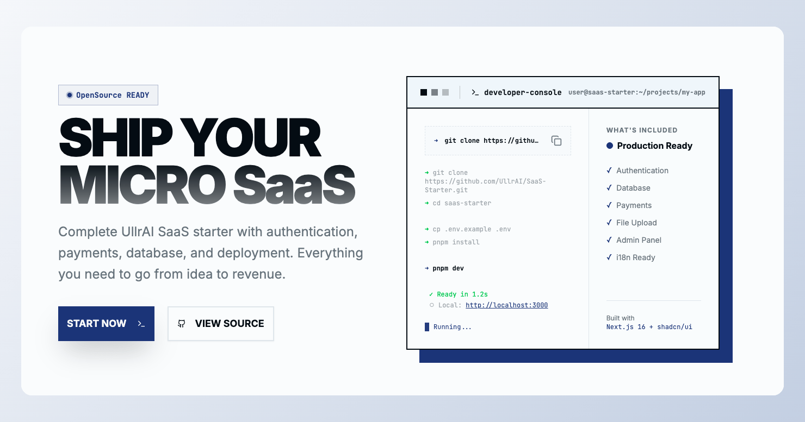

# VibeSKU Clips

[中文版](README.zh-CN.md) | English

VibeSKU Clips turns product links, photos, and a brief into a downloadable
15-second UGC product video. Choose a product, performer, scene, format, language,
and market; review the script, optionally review a storyboard, then confirm video
generation. Each work stays in one list from creation through download.

The platform produces video assets. Storefront links, inventory, publishing, and
performance tracking stay with the team that posts them.



## What it does

- **Product material and facts.** Import a page through Firecrawl or upload up to
  six product photos. Extracted facts become usable when parsing succeeds and
  remain editable on the product page. Warnings are advisory; missing essential
  material blocks generation.
- **Reusable talent and scenes.** Describe a fictional adult performer or supply
  authorized reference photos. Talent and scene libraries each generate one
  square reference sheet that can be reused across works.
- **Eleven formats.** Presenter, everyday scene, tutorial, tech demo, beauty
  routine, food and drink, apparel, styling, fit check, accessories, and unboxing
  each have their own script and shot vocabulary.
- **Two generation modes.** One-take draws an opening frame before generating
  video. Storyboard mode draws one frame per beat in sequence and waits for
  approval. Scripts always stop for review; storyboard and video generation
  require confirmation.
- **Language and market controls.** Clip language, target market, and interface
  language are separate. The interface supports English and Simplified Chinese;
  clip languages include English, Spanish, Portuguese, Japanese, Korean, and
  Simplified Chinese.
- **Versions and downloads.** Review generated versions, revise the script or
  frames, and regenerate. Video and SRT subtitles are archived in private R2
  storage; scripts retain publish captions and AI disclosure text.
- **Durable tasks.** PostgreSQL, pg-boss, and a task-run outbox preserve progress
  through restarts. Failed or stalled steps surface in the console with retry
  actions. Usage records retain generation costs and output lineage.

Every clip targets **15 seconds** with **9:16 or 16:9** framing. Models and
resolutions depend on the selected provider:

| Video provider | Model            | Resolutions       |
| -------------- | ---------------- | ----------------- |
| Prism          | H3               | 480p, 720p        |
| lk888          | H3               | 720p, 1080p, 2K   |
| lk888          | Seedance 2.0/2.5 | 480p, 720p, 1080p |

The current quality report checks script lengths and records the requested clip
duration. It does not independently measure the video duration or inspect the
rendered product, identity, and language. Review the actual video before use.

## Production flow

The default path is **product → script review → video → download**. Storyboard
mode adds a reviewed storyboard between script and video. When a product is still
being read, the work waits; once usable, it starts the script automatically.

| Job                   | Purpose                                                  |
| --------------------- | -------------------------------------------------------- |
| `ugc.product.ingest`  | Import page material and extract product facts           |
| `ugc.talent.generate` | Generate a reusable performer reference sheet            |
| `ugc.scene.generate`  | Generate a reusable scene reference sheet                |
| `ugc.work.script`     | Write a script and wait for review                       |
| `ugc.work.storyboard` | Draw sequential key frames and wait for approval         |
| `ugc.work.video`      | Generate video, archive media, and record quality checks |

The Web process enqueues tasks. The separate Node Worker calls Firecrawl, the
LLM, and media providers. Prism generates images for both video backends. Private
image references are signed at the Worker boundary, and provider outputs are
copied to R2 because their original URLs expire.

## Stack

Next.js 16 App Router, React 19, TypeScript, Tailwind CSS v4, shadcn/ui, next-intl,
PostgreSQL, Drizzle ORM, pg-boss, Better Auth, Resend, Cloudflare R2, Stripe, and
Vercel AI SDK v7. Repository Markdown is compiled with Content Collections.

## Quick start

Requires **Node.js 22.12.0 or newer**, **pnpm 10.33.0**, and PostgreSQL.
Rendering also requires your own LLM, image/video provider, and R2 credentials;
these hosted services are separate from the source-code license.

```bash
git clone https://github.com/UllrAI/VibeSKU-Clips.git
cd VibeSKU-Clips
pnpm install --frozen-lockfile
cp .env.example .env
openssl rand -base64 32
```

Use the generated value for `BETTER_AUTH_SECRET`, then fill in `.env` with your
own service credentials. Placeholder values do not make a working installation.

### Configuration

[`.env.example`](.env.example) is the configuration template. Web validates its
settings in [`env.js`](env.js); the Worker validates its subset in
[`worker-env.ts`](src/lib/jobs/worker-env.ts).

| Settings                                                                    | Purpose                                                                                      |
| --------------------------------------------------------------------------- | -------------------------------------------------------------------------------------------- |
| `DATABASE_URL`                                                              | Required PostgreSQL application database                                                     |
| `JOB_DATABASE_URL`                                                          | Optional separate queue database; defaults to `DATABASE_URL`                                 |
| `NEXT_PUBLIC_APP_URL`, `BETTER_AUTH_SECRET`                                 | Public origin and a random session secret of at least 32 characters                          |
| `RESEND_API_KEY`, `RESEND_EMAIL_FROM`                                       | Magic-link authentication; sender must use a verified domain                                 |
| `LLM_API_KEY`, `LLM_BASE_URL`, `AI_DEFAULT_MODEL`                           | LLM access; defaults to OpenRouter and `openai/gpt-5.6-luna`                                 |
| `FIRECRAWL_API_KEY`, `FIRECRAWL_API_BASE_URL`                               | Worker product URL imports; default root is `https://api.firecrawl.dev/v2`                   |
| `PRISM_API_KEY`, `PRISM_API_SECRET`, `PRISM_API_BASE_URL`                   | Worker image generation and Prism video; credentials must match the selected host            |
| `VIDEO_GENERATION_PROVIDER`                                                 | `prism` (default) or `lk888`; configure the same value for Web and Worker                    |
| `LK888_API_KEY`, `LK888_API_BASE_URL`                                       | Required key for lk888 video; default root is `https://api.lk888.ai`                         |
| `R2_ENDPOINT`, `R2_ACCESS_KEY_ID`, `R2_SECRET_ACCESS_KEY`, `R2_BUCKET_NAME` | Private uploads and generated media, shared by Web and Worker                                |
| `STRIPE_SECRET_KEY`, `STRIPE_WEBHOOK_SECRET`, `STRIPE_ENVIRONMENT`          | Billing; matching test/live credentials and webhook signature secret                         |
| `GOOGLE_*`, `GITHUB_*`, `LINKEDIN_*`                                        | Optional OAuth client ID/secret pairs                                                        |
| `DB_POOL_SIZE`, `JOB_DB_POOL_SIZE`, `WORKER_GRACEFUL_TIMEOUT_MS`            | Connection budget and Worker shutdown timeout                                                |
| `RATE_LIMIT_IP_HEADER`                                                      | Trusted ingress header; defaults to `x-forwarded-for`; the proxy must overwrite client input |
| `BING_SITE_VERIFICATION`, `NEXT_PUBLIC_UMAMI_*`                             | Optional deployment-specific site verification and analytics                                 |

`SITE_CONFIG` in [`src/lib/config/site.js`](src/lib/config/site.js) owns brand,
contacts, links, and the `emailAuth`, `billing`, `uploads`, and `ai` switches.
All switches default to enabled. Disable unused features before removing their
credentials. With email authentication disabled, configure at least one complete
OAuth provider. The AI switch controls the assistant; clip production still
needs its Worker integrations.

Prism defaults to staging in development and production in production builds.
Set `PRISM_API_BASE_URL` explicitly for your account. The development Docker
Compose example defaults to staging even though its containers use production
builds.

Keep the R2 bucket private and allow your application origin in its upload CORS
policy. Direct uploads need `PUT`, `Content-Type`, and `If-None-Match`; see
[Docker setup](docker/README.md) and [architecture](docs/architecture.md).

Example R2 CORS policy; replace the origins with your own:

```json
[
  {
    "AllowedOrigins": ["http://localhost:3000", "https://yourdomain.com"],
    "AllowedMethods": ["PUT"],
    "AllowedHeaders": ["Content-Type", "If-None-Match"],
    "ExposeHeaders": ["ETag"],
    "MaxAgeSeconds": 3000
  }
]
```

### Database and development

Create the database referenced by `DATABASE_URL`, then apply committed migrations:

```bash
pnpm db:migrate
pnpm dev
```

Open [http://localhost:3000](http://localhost:3000). `pnpm dev` runs both Web and
Worker with file watching. `pnpm dev:web` starts only Web; queued jobs need a
separately running Worker.

The Worker also applies committed migrations at boot under a PostgreSQL advisory
lock, including pg-boss setup. Repeated boots are safe; migration failure stops
the Worker. Web never migrates. The Worker database role therefore needs schema
migration permissions. Use `pnpm db:generate` for shared schema changes; reserve
`pnpm db:push` for disposable local iteration.

Sign up normally, then grant admin access explicitly if needed:

```bash
pnpm set:admin --email=your-email@example.com
```

### Optional billing setup

With billing enabled, configure your own Stripe account and run:

```bash
pnpm stripe:sync-products
```

This updates the selected test/live catalog in
[`src/lib/billing/stripe/prices.ts`](src/lib/billing/stripe/prices.ts). Existing
catalog IDs belong to the reference deployment; they are public identifiers,
but another Stripe account cannot reuse them. Review the generated diff before
deployment. See [webhook operations](docs/webhooks.md).

## API and CLI authentication

Browser users use session cookies. Machine endpoints under `/api/v1/*` use
user-managed API keys or browser-approved CLI sessions. Manage both at
`/dashboard/developer`.

```bash
pnpm vibesku-clips-cli -- auth login --base-url http://localhost:3000
pnpm vibesku-clips-cli -- auth status --base-url http://localhost:3000
```

Scripts may use `VIBESKU_CLIPS_CLI_API_KEY` instead. The current CLI supports
login, status, refresh, and logout; it is an authentication tool. See
[CLI documentation](packages/cli/README.md).

## Development checks

| Command                      | Purpose                                           |
| ---------------------------- | ------------------------------------------------- |
| `pnpm lint`                  | ESLint                                            |
| `pnpm type-check`            | Generate content/route types and check TypeScript |
| `pnpm test --runInBand`      | Jest tests                                        |
| `pnpm test:e2e`              | Build and run Playwright browser tests            |
| `pnpm test:jobs:integration` | Durable-job database integration tests            |
| `pnpm dead-code:check`       | Unused files, exports, and dependencies           |
| `pnpm prettier:check`        | Formatting                                        |
| `pnpm build`                 | Standalone Web build plus Worker artifact         |
| `pnpm worker:start`          | Run the built Worker                              |
| `pnpm analyze`               | Production bundle analysis                        |

E2E requires `E2E_DATABASE_URL` pointing to a dedicated local database whose name
contains a standalone `e2e` or `test` segment. Never use a regular application
database. The runner applies migrations and cleans its fixtures; it generates a
per-run test secret when one is not provided.

## Deployment

Run **both Web and Worker** from the same release. `pnpm build` prepares the
standalone Web output and `dist/worker/worker.mjs`. `pnpm start` runs only Web;
run the Worker separately with `pnpm worker:start` and supply its environment
through your process manager. `NEXT_PUBLIC_APP_URL` must be correct at build
time. Use `/api/health` for liveness and `/api/ready` for database readiness.

- [Docker setup](docker/README.md): a development Compose stack with PostgreSQL,
  migrations, Web, and Worker. Example database credentials are for local use.
- [Zeabur deployment](docs/deployment-zeabur.md): separate Web/Worker services,
  production migration access, backup configuration, and fork instructions.

The reference deployment tracks `prod`. A reviewed default-branch commit is
promoted by pushing a `release/vX.Y.Z` tag matching `package.json`. The release
workflow checks Quality for that exact SHA and applies migrations before moving
`prod`; do not push directly to that branch. Forks configure their own GitHub
`production` secrets, migration tunnel, and branch filters.

## Repository and self-hosting notes

- Replace brand, support/legal/privacy contacts, social links, and blog author
  information for your deployment. Credentials never belong in client-safe
  `SITE_CONFIG` or `NEXT_PUBLIC_*` variables.
- Use your own Stripe catalog, OAuth applications, verified email domain, R2
  bucket, analytics website ID, and Bing verification token.
- The code contains Prism production/staging API roots. Source access does not
  provide service access; configure an authorized provider account.
- Keep `.env` files, private keys, database backups, logs, customer material, and
  generated production media out of Git. `.env.example` contains placeholders.
- [Open-source review](docs/open-source-review.md) records the current repository
  inspection and outstanding dependency/configuration concerns.

See [AGENTS.md](AGENTS.md) for repository conventions, [design.md](design.md) for
UI guidance, [background jobs](docs/background-jobs.md) for task operations, and
[AI agents](docs/ai-agent.md) for the assistant architecture. Report vulnerabilities
privately through [SECURITY.md](SECURITY.md).

## License

[MIT](LICENSE). Dependency licenses and third-party service terms remain separate.
The homepage images are AI-generated concept photography; provenance is documented
in [landing assets](docs/landing-assets.md).
