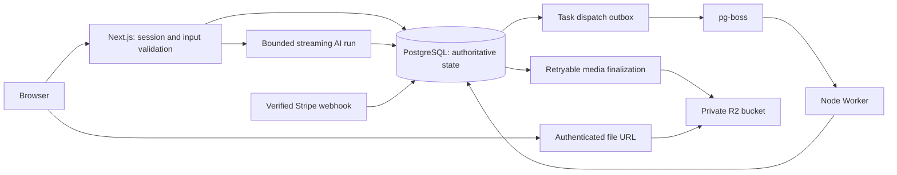

# Architecture consistency and recovery

The application remains a modular Next.js monolith with a separate Node Worker,
PostgreSQL, pg-boss, Stripe, and private R2 storage. These changes add durable
boundaries to existing operations without another queue, cache, or service.

## Resolved boundaries

| Finding                          | Implementation                                                                                                                                                                                                                                        | Regression coverage                                                                                                                           |
| -------------------------------- | ----------------------------------------------------------------------------------------------------------------------------------------------------------------------------------------------------------------------------------------------------- | --------------------------------------------------------------------------------------------------------------------------------------------- |
| F1: task acceptance and delivery | Task and outbox commit together; periodic dispatch uses stable job IDs; terminal queue failures reconcile product state; continuation changes payload and dispatch ID atomically.                                                                     | DB commit followed by delivery failure; queue acceptance with lost acknowledgement; supervisor failure; two Workers and delayed continuation. |
| F2: idempotency input mismatch   | Reuse compares normalized accepted input and rejects a different payload with 409.                                                                                                                                                                    | Concurrent duplicates and changed payload against PostgreSQL.                                                                                 |
| F3: replayable tool approvals    | Signatures bind user and conversation; server validates pending decisions against stored messages. Storage effects use stable conversation/tool-call/content identity and conditional PUT.                                                            | Real SDK signature checks, conversation-bound handles, transcript tampering/replay, concurrent storage retries after uncertain PUT.           |
| F4: AI lifetime and accounting   | One active run per user; three-minute abort; five steps; 4096 output tokens per step; rolling admission reservations. Response, pending message and usage commit together before R2. Worker retries media and guards against overwriting a later run. | Concurrent admission, request deduplication, retained unknown reservations, R2 outage, stale/concurrent media finalizers.                     |
| F5: subscription restriction     | Provider status stays provider-owned. Access is denied while any linked payment is refunded or disputed. Management remains available. Active renewal grace is limited to 24 hours.                                                                   | Provider refresh cannot clear a disputed payment; resolution restores access; grace and cancellation bounds.                                  |
| F6: private and deletable files  | Owner/admin authorization precedes five-minute signed GET; personal list/delete endpoints; immediate tombstone and asynchronous physical removal; generated links and historical records use authenticated URLs.                                      | Owner isolation, deletion retries, browser list/download/delete, migration of Unicode/reserved-character URLs.                                |
| F7: authoritative conversations  | Client sends one new message or decision plus parent ID. Server rebuilds history, checks stale parents and duplicate IDs, derives provider handles from stored data, and paginates history.                                                           | Forged history, stale tabs, cross-conversation handles and history pagination.                                                                |
| F8: feature dependencies         | Disabling uploads removes document storage and image generation; image allowance removes the image tool; a completed image call removes it from subsequent steps.                                                                                     | Actual agent configuration matrix.                                                                                                            |
| F9: verification and promotion   | Quality runs DB integration and Worker checks. Release requires successful Quality for the exact default-branch SHA and successful one-shot migrations before updating prod.                                                                          | Full local checks plus the same commands in Quality.                                                                                          |

Web and Worker now use one database client factory and the same UTC timestamp
codec. Shared runtime fields live in `src/lib/config/runtime-env.mjs`; each
process chooses its pool default. Machine credentials share a user-level rate
limit, task creation limits unfinished work to 100 per scope, and authentication
infrastructure errors reach the error boundary. Admin mutations emit structured
actor/target logs; queue backlog and age are reported every minute. Configure
log retention in the deployment platform; this is operational auditing, not an
immutable compliance ledger.

## Deployment requirements

1. Configure the GitHub `production` environment secret `PRODUCTION_DATABASE_URL`.
   Set `PRODUCTION_JOB_DATABASE_URL` only for a separate queue database. The runner
   reaches the private Zeabur PostgreSQL through the dedicated SSH tunnel described
   in [the deployment runbook](deployment-zeabur.md#migration-network-access).
   Missing credentials or tunnel access block promotion.
2. Deploy Web and Worker from the same release commit and Dockerfile. Give the Worker the four R2
   credentials and the same upload quotas as Web, so it can finalize media and
   remove deleted/abandoned objects. No model credentials are needed for media
   retries; the Worker does not replay an interrupted AI generation.
3. Disable public bucket access, custom public domains, and `r2.dev` for the user
   upload bucket. Code and SQL cannot revoke an already-public object URL. For
   an existing deployment, pause uploads and drain in-flight Web requests while
   applying migrations 0025–0026 and deploying both processes; reopen after public
   access is disabled and authenticated access is verified. Do not keep old Web
   replicas writing public URLs during this cutover.
4. Existing file metadata and structured AI file/tool links are migrated. Text
   already copied outside the application cannot be recalled; disabling bucket
   public access also invalidates those old URLs. Previously issued signed GETs
   can remain usable for up to five minutes after deletion.
5. This release changes the chat protocol. Refresh open AI tabs after deployment.
   Legacy unscoped response handles are ignored and bounded local history is used
   instead. Queue reconciliation adopts pre-outbox queued/poll jobs from pg-boss.

## Runtime guarantees and limits

Task and object delivery are at least once. External job handlers must keep using
provider idempotency keys. New mutating AI tools must implement idempotency with
`userId + conversationId + toolCallId`; a signed approval alone is not an
execution ledger. The bundled save-document operation is idempotent.

`AI_DAILY_TOKEN_LIMIT` defaults to 2,000,000 admission units per rolling 24 hours.
Each admitted run reserves 400,000; reported token totals replace the reservation.
Unknown provider usage retains the reservation. This prevents unmetered retries;
it is not a provider invoice or a strict monetary cap. `AI_DAILY_IMAGE_LIMIT`
defaults to 10. Failed calls that never start the provider release reservations.
Use provider-side spending limits when an account requires a hard cost ceiling.

Generation stops on timeout or cancellation. A process killed before its final
response transaction commits leaves an interrupted run with reserved usage;
the application does not automatically repeat a possibly paid generation.
Media failures after that transaction are recoverable by the Worker. Long
conversations remain readable in pages of 80 messages; sending is bounded to
80 stored messages and 64 KiB of serialized context, with a localized prompt to
start a new conversation when full.

The PR does not deploy, change a live bucket, migrate production, or call paid
providers. Unit/SDK and PostgreSQL integration tests inject external failures;
E2E exercises the production build with isolated fixtures and simulated provider
streams. Production promotion and bucket access still need the deployment
configuration above.
